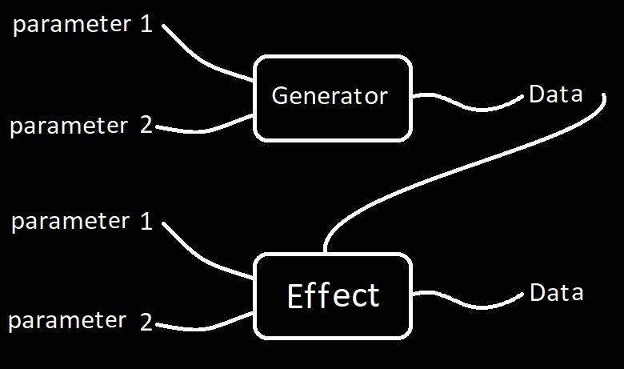

# SBR language 🚀

 

The SBR language provides super creative tools
to musicians to make good music and from this make memorable melodies

With all my heart I hope that good things can be
made with this tool, I hope that people have fun experimenting
with it and that it helps all of you make better music, hugs 💙

@Brick\_briceno 2023

## Key Features ✨

- **Intuitive Syntax**: Designed to be easy to learn and use.
- **Interoperability with Python**: You can use SBR data types with Python


## Install

```bash
git clone https://github.com/Brick-Briceno/SBR.git
cd SBR
pip .
```

***The program must have a main.sm file to work, in which the data, commands or variables that you want to have loaded whenever you run the interpreter will be stored.***

## How to use

***To learn how to use it with "help:" in the console and all the information will appear***



It's not necessary to have 2 parameters, it can be just one

### Syntax

In case of havin purely numeric characters, it will be  
prossed as a mathematical operation and the order of the  
operations will be based on the PEMDAS standard (parentesis,  
exponents, multiplication, addition, subtraction)  

Examples:
```
5+5*2 = 15  
(5+5)*2 = 20

--You can do this as well  
(5+5)2 = 20  
```

but... and if it's melodic?  

However, in case of containing generators, effects or any musical data  
such as notes, tones, rhythms or a groups, everything will be  
processed left to right in this order  

Examples:  
```
  ↓↓↓↓all this are an argument, only one  
 B1000 L8 = B1000 1000  
 ↑     ↑     ↑  
 ↑     ↑     (zeros and ones) these are the rhythm data  
 ↑    (L) repeats the number of bits until x number long (effect)  
(B) is used to generate the bits (generator)  
```

The total of all the code is called Brick :D  
Other example  

```
 M0,-2,2,-1  
 ↑     ↑  
 ↑    (0,-2,2,-1) arguments are separated by commas  
(M) is used to generate the tones  
```

### Run some of these commands to take full advantage of the language's potential
```sbr
help: tutorial
help: effects --view all effects
help: generators --view all generators
help: commands --view all commands
help: operators
help: syntax
help: E

vars: --view actual variables

play: Sm{son*2; Jumps 5,-1,5,-1,5,-1,-2,-1,-1 Oct5}
play: Sm{E13S12X2; pop Oct6 Arp}*4
play: Sm{son S4 X2; pop Oct5}*4

```
```
-- this is a short comment :)

***
this is...
a long comment
I can write things
on the lines I want to
write, basically a multi-line comment
***

```
```
-- these are rhythms
B1000*4
C3
E5,16

-- these are notes
1|5 -- 1st degree of the 5th octave
1b|7 -- 1st degree flat, 7th octave
1#|7 -- 1st degree flat, 7th octave

```
```
-- these are groups
-- you can save things in them

{} -- empty group

{1; 2; 3; 4; 5 -- you don't need a ";" here
6; 7; 8; 9}

-- this
{B10010010
{69}; 18
M0,1,2,3,4}
-- this is the same as this
{B1001 0010; {69}; 18; M1|, 2|, 3|, 4|, 5|}

```
```
-- these are tones
M33,34,35
M6|4, 7|4, 1|5

-- they are like groups but with notes
```

```
-- this is a melody

Sm{son*2; Jumps 4,1,-2,-1,-1,1,-1,-2,1 Oct5}

Sm{-- the melody must have rhythm and tones
B1001 0010 0010 1000*2
M1|5, 5|5, 4|5, 2|6, 1|6, 6|6, 5|6, 3|6, 2|6
}

play: Sm{son*2; Jumps 4,1,-2,-1,-1,1,-1,-2,1 Oct5}

```

### How to import Instruments and Sounds

You can import an instrument this way
**I recommend that you load all the instruments and sounds you are going to load in the initial main.sm file to avoid this repetitive task**

```
--Instruments
instrument: inst\Synt1
instrument: inst\Synt3

--Samples
instrument: inst\Vocal.wav

--Percusions
instrument: inst\Kick.wav
instrument: inst\Clap.wav
instrument: inst\Hat.wav
instrument: inst\Snare.wav
```

```
-- The instruments are called this way
$Synt1
$Kick

-- They will show something like this in the console
$12 ***$Synt1 recorded instrument from 'inst\Synt1'***
$15 ***$Kick sampled instrument from 'inst\Kick.wav'***

```

**The letter V indicates the velocity or force with which a note is hit, but in this case it means the decibels of the track. In melodies it ranges from 0 to 1, but in the case of structures it works from -∞ to 0**
```
-- creating a polyrhythm in SBR
tempo = 103
i_dance = Struct{
  V0; $Kick; bossa*2
  V0; $Clap; C8 >>4
  V0; $Hat; E13L32
}

play: i_dance * 2

```

