# ✨Teoría Musical Básica 🎵
By [@Brick\_briceno](https://www.instagram.com/brick_briceno) 🖤

A Todos nos gusta la música ¿A quién no le gusta la música? Pueden desbordar nuestros sentimientos en lágrimas, puede usarse como tratamiento terapéutico, puede hacerte bailar, puede emocionarte, incluso en las manos equivocadas puede usarse como control político, infinitos usos, lo que está claro aquí es… que es un poder infravalorando para muchos

¿Por qué esa canción suena triste? ¿Por qué este ritmo me incita a bailar? Por qué la música de “Linkin Park”🌧️🖤 sonaba tan triste y tan épica? Por qué el tema de “Up” la película🎈🏠 suena tan nostálgico? Por qué la intro de Disney suena tan mágica y soñadora ✨🔮 por qué la música pop, y los hits de los últimos 50 años suenan tan pegajosos? 🌈 ¿Por qué el jazz suena a jazz? ¿Quieres experimentar tú mismo estás emociones en tu instrumento o en un PC?

En este documento conseguirás ejemplos y analogías que en ningún otro lado conseguirás, no estoy exagerando, entenderás la música como ningún músico la aprendió en su momento, y espero, que te diviertas haciéndolo

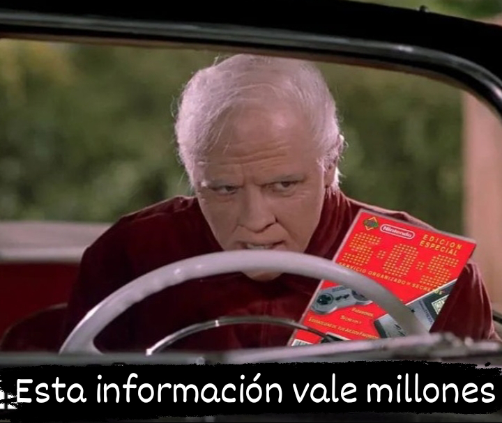  

Para no perder mucho tiempo en tu viaje por la música este documento estará dividido en 3 partes, la parte armónica, notas y todo eso, la parte rítmica, y al final uniremos todo eso, te explotará la cabeza, empecemos 😎😉

**Parte 1: Melódica armónica** 🎹

**Un poco de contexto** 🎹🐕

Esto es un piano, quizás lo abras visto antes  
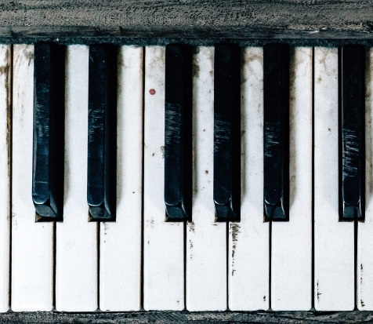  

Existen 12 notas ¿por qué? lo veremos más adelante, pero existen 12, como imaginarás hay pianos o teclados que tienen 88 notas, lo que pasa es que esas mismas notas se repiten varias veces, en varias “octavas”

¿Que es una octava?  
*Es la misma nota, solo que más aguda o más grave*

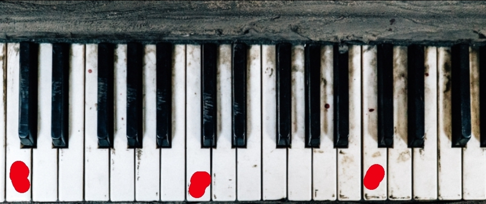  
*¿Ves que hay 2 teclas negras que están juntas? ¿Vez que también hay 3 teclas negras juntas? La tecla blanca que está debajo de las 2 teclas negras se le llama “Do”, o “C”*

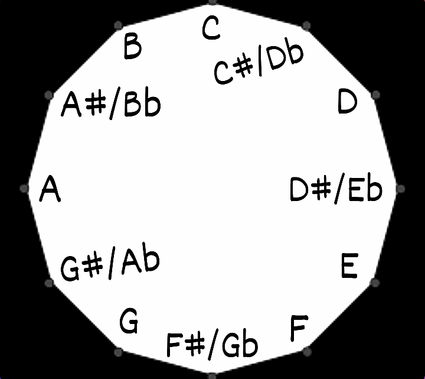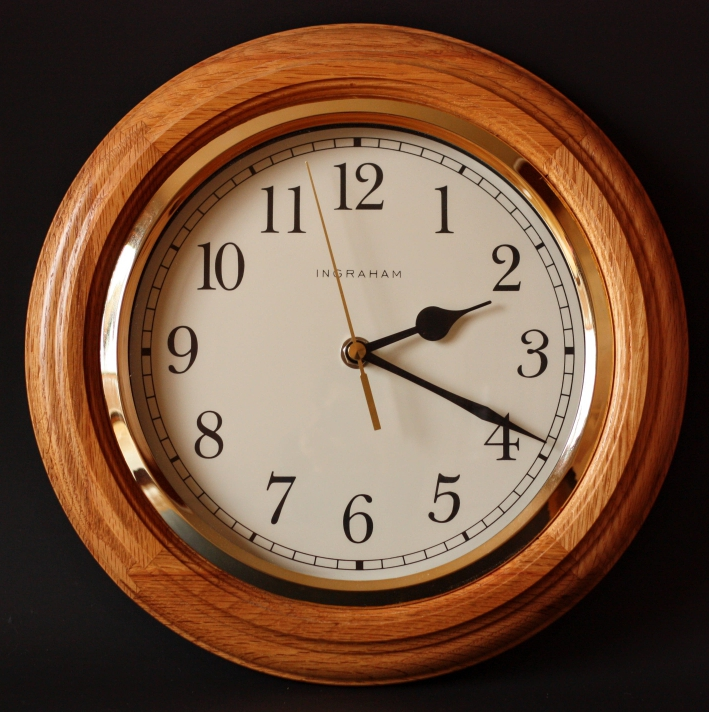  

*Las **12** notas que se **repiten** y vuelven a empezar como **un bucle** puedes verlo como **un reloj de 12 horas*** 🕒

En la música, de estas 12 notas tomamos 7, el 99% de las veces

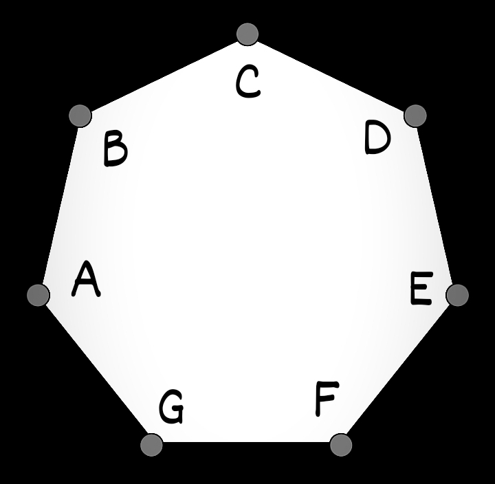  
*Puedes verlo como un reloj de 7 horas, pero como es algo a lo que no estamos acostumbrados mejor verlo como **los 7 días de la semana**, lunes, martes, miércoles, jueves, viernes, sábado y domingo* 🗓️

*Lo que quiero que se te quede en la mente es que hay 12 notas y una escala es literalmente hacer un grupo de notas, una selección, escoger algunas de ellas para hacer una escala, escalera se llama así porque subes y bajar por grupos, escalones o tonos que se pueden medir*

**¿Por qué esas letras? ¿CDFGAB?** 🤔

Son las primeras 7 letras del abecedario, solo que empieza desde la C ¿por qué? 

Los griegos usaban letras griegas para su música, después en reino unido empezaron a usar letras latinas, las que usamos en el inglés y el español, de ahí las notas

Se pronuncian de la siguiente manera  
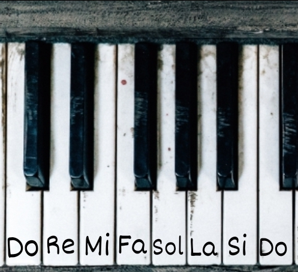  
*La=A, Si=B, Do=C,*  
*Re=D, Mi=E, Fa=F, Sol=G*

Y qué pasa con las otras 5 notas negras?  
Se llaman sostenidos y bemoles

Si ves que sale ***C\#*** se llama ***Do sostenido***  
Y si ves que sale ***Cb*** se llama ***Do bemol***

A*b*\=La bemol, G\#=Sol sostenido, B*b*\=Si bemol, etc, esto quiere decir que las teclas negras tiene 2 nombres, G*b* (Sol bemol) se puede llamar F\# (Fa sostenido)

F\# y G*b* son la misma nota “suenan igual”, está debajo del sol y arriba del fa

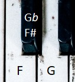  

*Un dato curioso es que* No siempre es correcto llamar a esa nota F\# o Gb, dependiendo de en qué escala estés esa nota se llama de una forma u otra, aunque sean la misma ¿Por qué? Lo veremos más adelante 😉

Otro dato curioso que que a las notas **Añadimos un número** que indican su octava, un piano puede tener desde un A0 hasta un B10

C\#5 \= “Do sostenido cinco”  
D*b*3 \= “Re bemol tres”

Esta es la forma en la que los músicos nos comunicamos, y esto es la punta del iceberg…

**Agiliza tu cerebro** 🧠

  

*¿Ya sabes identificar el “C” (Do)?* 

*Perfecto, igual te recuerdo que es la nota blanca bajo las 2 notas negras ;D*

*¿Sabes dónde está el “D” (Re)? ¡Perfecto\!*

*Igual si no la encuentras rápido te digo que la nota que está entre las 2 teclas negras, o la que viene después del C 🤷🏻‍♀️*

*Te recomiendo que te tomes un momento y veas por un buen rato el piano, y busques rápidamente dónde está el G (sol), dónde está el A\# (La sostenido) y así, recuerda que todo esto es práctica, la idea es que tú cerebro se adapte a la música y eso se logra con práctica*

Si ya dominas esto perfecto\! podemos empezar a jugar con las notas, seleccionando sólo un conjunto de ellas

**Escalas** (Escalera)

Si de estás 12 notas quiero tomar solo 6 de ellas por ejemplo

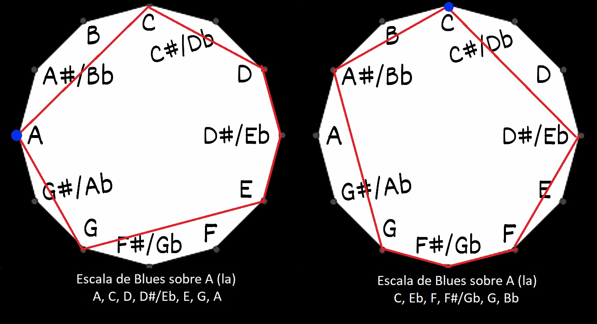  
*Escala de blues, sobre A y sobre C, escala muy usada en el género blues*

Hay muchos tipos de escalas pero las más usadas son un grupo de **7** escalas de las que **2** son las más comunes, que en realidad son una misma escala, solo que como vemos en la imagen de arriba empezamos desde el punto azul, pero podríamos empezar desde cualquier otro lugar, a esto le llamamos modos, pero si no lo entiendes, tranquilo, profundizaremos esto en el capítulo 3, sobre armonía modal

Lo cierto es que hay 2 escalas que usaras el 95% de las veces, la “escala” o mejor dicho el modo, mayor y menor que en realidad son lo mismo pero **una es el espejo de la otra**, es así

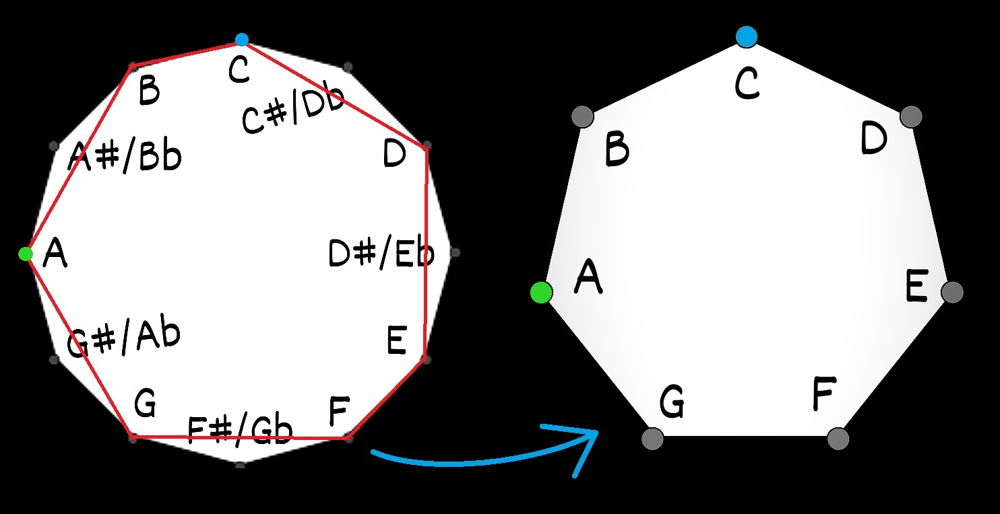  
Observe la figura geométrica que forma las líneas Rojas es una forma de 7 esquinas que forma una escala de 7 notas, los modos es donde empiezas es figura, si la empiezas desde el punto Azul será una escala de Do Mayor, en cambio si empiezas desde el punto Verde tendrás una escala de La menor, no es menor porque empiece en A, es menor porque si empiezas desde esa esquina específica con esa figura geométrica específica tendrás ese sonido, podrías girar esa figura en círculos como una rueda y tener un Sol menor, o un Si bemol mayor si empiezas desde la esquina azul

Con eso podemos ver también que C mayor y A menor son la misma escala ya que tienen las mismas notas\! y notamos también que estas escalas no tienen sostenidos ni bemoles, vuelve a mirar la figura

Ahora ¿si son las mismas notas, no debería ser la misma escala? pues no ya que transmiten sensaciones diferentes, puede ser subjetivo pero para que te des una idea el modo menor puede sonar más triste, melancólico o épico que el modo mayor, que suele ser más feliz, alegre aunque también algo epico, igual podría haber una canción en modo mayor animada como la de “piratas del caribe” que está en Re menor pero es muy animada, o la canción de “let it be” que está en modo mayor pero que es algo nostalgica, las sensaciones de una canción depende de los acordes, su bpm o tempo que veremos en el capítulo 2, o de su armonía que veremos en el capítulo 3

Si no entendiste bien lo de las escalas quedate como que es simplemente un conjunto o grupo de notas que seleccionamos para hacer música, casi siempre son 7

Otro detalle importante es que las escalas tienen **grados**

Si estás en por ejemplo la escala de C mayor, o modo mayor sobre C, el primer grado sería esa misma nota, el segundo sería el D, el tercero E, etc, si estás en G mayor el primero sería G evidentemente, y el séptimo seria F\#, es simplemente ponerle un número a la nota de la escala para identificarla, esto es porque cada grado produce una emoción distinta

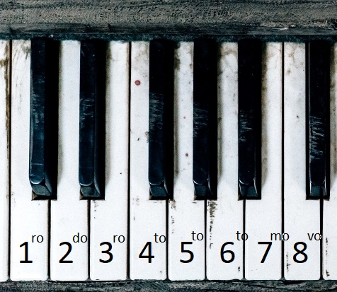  
*El octavo grado, puede ser llamado primer grado ya que son equivalentes, asi como el noveno grado puede ser llamado 2do grado también, por cierto, octava viene del octavo grado, misma nota pero una octava más aguda*

**Intervalos 🔢✌🏻**  
*Los intervalos son una parte importante de la música, ya que **lo que transmiten las emociones No son las notas, son las distancias entre ellas*** 🙀

*Saber contar intervalos te servirá para múltiples cosas en este documento, es esencial*

*Solo debes saber contar, así 1, 2, 3, 4, y listo :D*

*veamos una serie llamada…*

**Las 2 formas de ver la Música** ✨  
*Diatonico vs Cromatico, 7 vs 12*

*El **Diatonico** ve solo las notas “más importantes”, solo 7, como ver el reloj de 7 días de la semana que vimos anteriormente, solo las notas de la escala, simplificamos las cosas*

*Mientras que el **Cromatico** ve todas las notas, es como la langosta que tiene 12 receptores de color que le permite distingir colores que para nosotros son invisibles*

*Ambas formas de ver el mundo y la música se complementan, ninguna es mejor que la otra, ambas formas son igual de importantes*

**Cromático** 🌈**12**

*El **semitono (sT)** **es la unidad de medida del tono**, también está el tono (T) que son 2 semitonos, 1T \= 2sT*

Perfecto, ahora, piensa, ¿qué distancia hay desde **C** hasta **D**?  
respuesta: 2st, despues de C viene C\#, van 1, viene D, van 2, 2 st

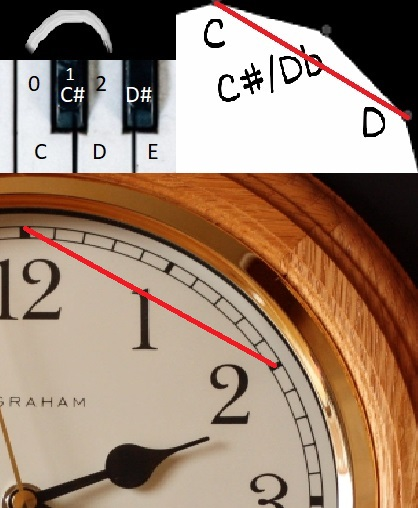  
*Podemos verlo como que desde esta parte hasta la otra hay 2 horas de diferencia, en el área de la música las horas serian los semitonos, desde C a D hay 2 notas cromáticas, 2 semitonos*

A estos le llamamos intervalos cromáticos, y para calcular intervalos cromáticos más fácilmente podemos usar uno de los muchos trucos que hay desde el punto de vista diatonico

**Diatónico** ✨**7**  
Aquí en vez de contar las notas contamos los grados

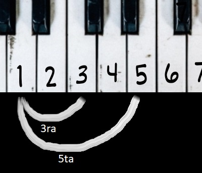  

De C a D hay una 2da, de C a E una tercera como se ve en el gráfico, de E a G hay una tercera también, de C a G abría una quinta, etc

**Acordes 🎹**  
Ahh como olvidar en el conservatorio cuando el profesor nos dividió en 3 grupos, sentados cantamos cada grupo una nota diferente, sonaba majestuoso 😌

Un acorde son 3 notas (a veces 4, a veces 5, a veces más) tocadas al mismo tiempo, fin, eso en un acorde 🤟🏻

*A diferencia de una **Melodía** que son varias notas tocadas una después de otra de forma rítmica*

A ver, si tocas un C3, un C4, y un C5, eso No es un acorde, son octavas, no vale si es la misma nota, deben ser notas diferentes 🤷🏻‍♀️

Para hacer un acorde en cualquier escala debes tocar una nota si y una nota no, y así sucesivamente :)

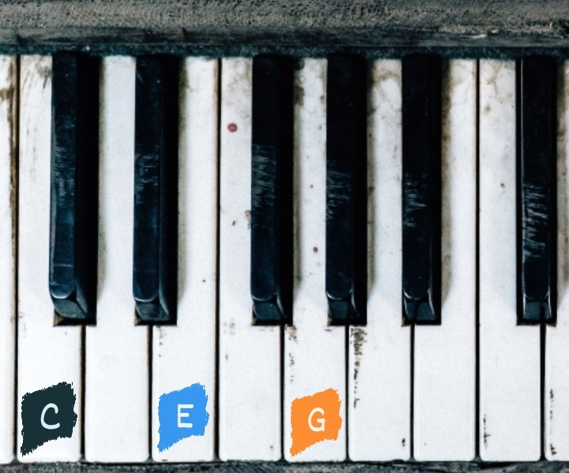  
*Acorde de Do mayor (C Maj)* 🌞

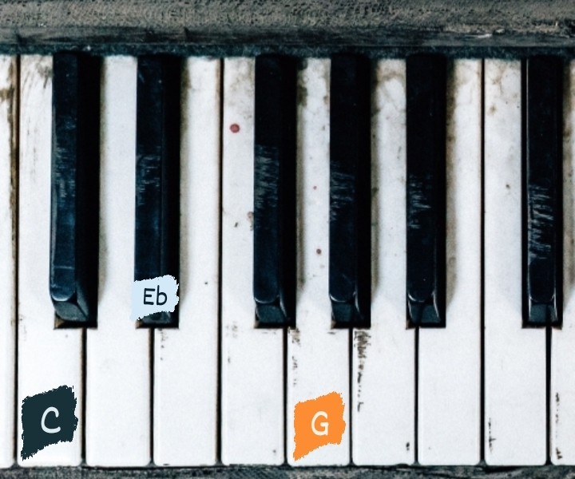  
*Acorde de Do menor (C minor)*

***¿Cómo sé qué acorde es mayor y cuál es menor?*** 🤔

Hay 2 formas de hacerlo, una forma rápida y fácil y otra difícil

1. **La fácil** es que si la escala es mayor y tenemos 7 notas tenemos 7 acordes, 3 mayores \+ 3 menores y uno disminuido, disminuido? Lo veremos más adelante 😉  
     
   ¿Recuerdas cuando te dije que vieras las notas como los 7 días de la semana en un bucle? Eso es porque mentalmente se te hará más fácil moverte por las notas así  
     
   Hay muchas escalas, muchas, pero vamos a mencionar 2, mayores 🌞 y menores 🌧️  
     
   Hay **acordes** mayores y menores y también  
   

| Grado | Escala Mayor 🌞 | Escala Menor 🌧️ |
| :---- | :---- | :---- |
| 1 | Mayor 🌞 | Menor 🌧️ |
| 2 | Menor 🌧️ | Disminuido 💀 |
| 3 | Menor 🌧️ | Mayor 🌞 |
| 4 | Mayor 🌞 | Menor 🌧️ |
| 5 | Mayor 🌞 | Menor 🌧️ |
| 6 | Menor 🌧️ | Mayor 🌞 |
| 7 | Disminuido 💀 | Mayor 🌞 |

*Esta sería la forma fácil, decir, ah es un primer grado? Es menor, que es un 3er grado ok es mayor, y listo\!*

2. Contando intervalos, si la fundamental y la 3ra tiene una distancia de 3 semitonos, es un acorde menor, si tiene 4 es mayor, esto en caso de que entre la fundamental y la 5ta hayan 7 semitonos de distancia  
   

| Acorde | 3ra | 5ta |
| :---- | :---- | :---- |
| Mayor 🌞 | 4sT | 7sT |
| Menor 🌧️ | 3sT | 7sT |
| Disminuido 💀 | 4sT | 6sT |
| Aumentado ✨🔮 | 3sT | 8sT |

   

Todos los acordes tienen sus 3ras y sus 5tas, y su fundamental

1. **Fundamental:** *primera nota del acorde, da nombre al acorde*  
2. ***3ra**: 2da nota del acorde*  
3. ***5ta**: 3ra nota del acorde*

  
Nos saltamos una nota

Solo debes saltarte una nota, ¿quieres un acorde de Sol mayor?

Toca G (sol) ✅  
viene A (la) te lo saltas ❌  
viene B (si), lo tocas ✅  
viene C (do) te lo saltas ❌  
viene D (re) lo tocas ✅

Te queda G, B, D, osea G mayor 👏🏻

También hay **Acordes de 4 notas** 4⃣  
Se llaman **Acordes con 7mas** (séptimas)

![][image18]  
Do mayor 7ma (C Maj7)

Intenta tocar los acordes en un piano, si no tienes hay aplicaciones de teclado para teléfonos y en PC 🎹

![][image19]  
*Acorde de Do menor con novena y también con séptima, (Cmin 7 Add9)*

*add 9 significa que se le añade una novena, add 7 una séptima*

***Acordes suspendidos** (sus2 y sus4)*  
*Se reemplaza la 3ra del acorde por una cuarta o una 2da*

*![][image20]*  
*Acorde C(sus4)*

*![][image21]*  
*Acorde C(sus2)*

**Disminuidos y Aumentados 💀✨**

Aquí no cambiaremos la 3ra si no la quinta  
Le meteremos un semitono de más o un semitono menos

![][image22]  
*Acorde de Do disminuido (Cdim)*  
*Exactamente igual a un acorde menor pero con la quinta disminuida, osea con un Semitono menos, osea una nota por debajo, en vez de G es un Gb*

![][image23]  
Acorde de Do aumentado, un acorde mayor pero con la quinta aumentada, osea una nota hacia arriba

**Inversiones 🤑💰**  
Todos los acordes que mencionamos se les pueden dar diferentes emociones aunque sean las mismas notas

1. **1ra inversión**: es cuando la 3ra del acorde es la nota más grave, en vez de ser C, E, G, sería E, G, C  
   ![][image24]  
     
2. **2da inversión**: es cuando la 5ta del acorde es la nota más grave, en vez de ser C, E, G, sería G, C, E  
   ![][image25]  
     
3. **3ra inversión**: es cuándo la 7ma del acorde es la nota más… bueno ya sabes el resto, en vez de ser C, E, G, B, ahora es lo mismo pero con la 7ma abajo, B, C, E, G  
   ![][image26]

Eso es un acorde, si cantas un C (Do), y tocas en el piano un G (Sol), y alguien toca un E (Mi) en una guitarra, eso es un acorde de Do mayor (Cmaj)

Si mandas a una orquesta sinfónica a tocar un E (Mi), pones a tocar en un mega equipo de sonido Un G (Sol) y pones a un estadio a entonar con mucha fuerza un C (Do) eso es un acorde de Do mayor

Pero si una mosca pasa y sus alas hacen un B (Si) y eso sale en la grabación, eso es un Do mayor con séptima (Cmaj7)

Si tocas en el piano un acorde de Do mayor (C, E, G) en todas sus octavas, con las manos, los pies, y hasta tu lengua, pero tú gato pisa un A (La) muy suave, eso ahora es un La menor con séptima (Amin7) ;D

A, C, E, G

Recuerda que los acordes son todas sus notas al mismo tiempo pero intenta tocarlas de abajo hacia arriba y de arriba hacia abajo (esto se llama **Arpegio**)

**Arpegio**: notas del acorde tocadas una por una, más bien una **progresión de Acordes** ¿Que es una progresión de Acordes? Lo veremos en el capítulo 3 :D

**Parte 2: El Ritmo** 🥁

**Bpm** el latido de la música  
Siglas de **B**eats **p**er **m**inute, no hay mucho que decir es el nombre por el que medimos la velocidad de la pieza, la canción

Un minuto tiene 60 segundos, si la pieza está a 60 bpm significa que hay un latido por segundo, ve un reloj y golpea una mesa cada vez que la aguja marque la línea de un segundo

Hay aplicaciones en internet que puedes usar para eso, busca metrónomo, es un aparato mecánico que hace un sonido cada negra, pero ¿Qué es una negra?

**Figuras**  
No lo veas como letras léelo como números 

| Redonda | 4 |
| :---- | :---- |
| Blanca | 2 |
| **Negra** | **1** |
| Corchea | ½ |
| Semi corchea | ¼ |

*Hay otras como la fusa y semi fusa que valen 1/8 y 1/16 pero son menos comunes*

Se escriben así

![][image27]  
*Redonda*  
   
![][image28]  
*Blanca*

![][image29]  
*Negra*

![][image30]  
*Corchea*

Y claro también existen figuras con cierta duración que representan silencio

**El compás 4️⃣/4️⃣**  
Es compás es como una memoria tiene un espacio limite, es como una botella de agua 💧

Empecemos por el compás más común de todos el 4/4, se usa el 95% de las veces y me atrevería a decir que más

*Por cierto se dice “cuatro por cuatro” a pesar que es una división se pronuncia como una multiplicación*

Tienes una botella de 4 litros, puedes tenerle 1 litro de agua, 1 litro de jugo, 1 litro de aceite y un litro de leche 🥛  
1+1+1+1 \= 4

Esto se visualizará de esta manera

Bits: una forma nueva de ver el ritmo

Polirritmia

**Parte 3: Uniendo las piezas 🌈✨**  
Entiende la música, armonía, simetría, dimensiones y sentimientos

**Harmonia: la clave de las emociones**

| Grado | Función |
| :---- | :---- |
| 1 | Tónica 🏠 |
| 2 | Supertónica 📉 |
| 3 | Mediante 🌅☔ |
| 4 | Subdominante o sensible modal 🌷 |
| 5 | Dominante ⭐ |
| 6 | Superdominante o submediante 🙀🔮 |
| 7 | Sensible, sensible tonal, subtónica o leading tone 📈 |

Arpegios

Más escalas: avanzado

El timbre: tipos de instrumentos y una introducción al diseño de sonido

Composición muy muy básica

Harmonia negativa

El ritmo euclidiano

Repetición

Esto es la punta del iceberg ;)

Mi opinión de la música

**Datos curiosos**

Existe un tipo de música llamada **Música microtonal**, que se encarga de experimentar con diferentes tipos de afinación donde hay más de 12 notas

Hay personas que hacen algo llamado **canto difónico** u “overtone singing” principalmente en Mongolia, es una habilidad que te permite cantar 2 notas a la vez

*Para más contacto, dudas o un apoyo económico, escribeme\! [@Brick\_briceno](https://www.instagram.com/brick_briceno)*  
