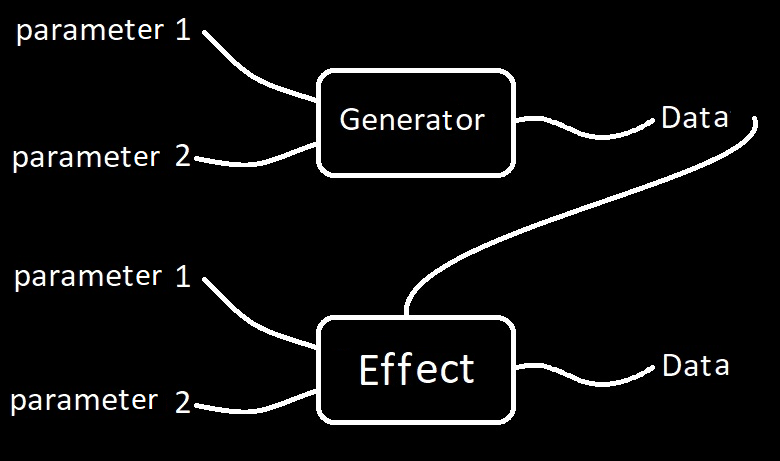

**Lenguaje SBR**  
Sintaxis Brick Ritmo

*Los siguientes son códigos para generar ritmos y melodías a través de algoritmos, sobre todo en el programa Symmetry Melody 2 creado por [@Brick\_briceno](https://www.instagram.com/brick_briceno/?hl=es)*

*Este mini tutorial estará dividido en 3 partes, primero la parte rítmica, seguido de la parte melódica o mejor dicho tonal, y finalmente la parte verdaderamente melódica, cómo unir un poco las piezas y algunas que otras herramientas del control de flujo, las palabras claves*

*Por cierto lo puedes descargar aquí:*  
[*Github.com/Brick-Briceno/SBR*](https://github.com/Brick-Briceno/SBR)

Para crear una melodía debemos definir como la sentimos, qué nos produce, y para eso entre otras como el tempo, tonalidad, escalas, acordes, entre otros trozos con los que armaremos la canción

Pero lo principal, es una buena melodía, que nos cuente cosas, hay cosas importantes en una melodía, cuánto dura una nota… qué tan fuerte golpea… pero los 2 elementos principales más importantes en mi opinión son y siempre serán 

Tonos y… ritmo

SBR ofrece su propio estilo y forma de representar y escribir las melodías, es como su propio pentagrama

Pero para entender la filosofía Symmetric melody, “Sm” debemos entender 2 de sus grandes pilares

Tonos y… ritmo

Empecemos por la parte rítmica 

**El Ritmo** 🥁

*Nuestras literalmente piezas de Lego serán…*

**Generadores:** C, B, E, A, N  
**Efectos:** L, X, D, R, I, \<\<, \>\>, \[, \], S, Q, \*  
**Operadores:** \+, \-, nada  
**Parámetros:** 1, 2, 3, 4, 5, 6, 7, 8, 9, 0

**C** (repetir un número)

*Cuando sale C seguido de un número significa que pondrá X pulsos cada determinada cantidad de tiempos hasta que el bucle termine, por defecto son 32 bits*

C3 \= 1001 0010 0100 1001 0010 0100 1001 0010  
C4 \= 1000 1000 1000 1000 1000 10001 000 1000  
C5 \= 1000 0100 0010 0001 0000 1000 0100 0010

Si quieres que la longitud del bucle sea 8 lo escribes así

C3,8 \= 10010010

la **C** es un **Generador**, los generadores pueden admitir varios parámetros, son como una especie de maquinita que le metes uno o más datos y te arroja un resultado, si nos ponemos más técnicos es en programación o matemáticas lo que llamamos una función

  
*Esto en SBR se Le conoce como bloque o Brick, se compone de:*

*Un generador (indispensable)*  
*Parámetros (opcional)*  
*Un efecto (opcional)*  
*Parámetros para el efecto (opcional)*

Puede haber un generador sin parámetros y con un valor preestablecido, puede también tener parámetros, puede tener efectos y estos pueden o no tener parámetros, al fin y al cabo en un bloque no puede haber 2 generadores, pero si en un código unimos varios bloques simplemente se pegan sin más complejidad

Pero… ¿Y qué es un efecto?

**L** (definir la **L**ongitud)

la L es nuestro primer efecto

Si quieres que la longitud de un dato o ritmo sea 8 lo escribes así tambien

Se repite el bucle hasta finalizar las 8 semicorcheas o bits, pero recuerda que estamos en base a 16 por lo si no ponemos el valor L seguirá hasta llegar a 16

En realidad quedaría así

C3,16 \= 10010010 01001001

C3,16 \= C3L16

Si tenemos un ritmo más corto que el parámetro de L este repetirá el bucle hasta completar el parámetro L, osea lo cortará hasta donde este diga

Por ejemplo

C3L4L8 \= 1001 1001

C3 nos arroja una secuencia de puros “100” repetidos hasta llegar a una longitud de 32, con L4 lo recortamos a 4 bits “1001” y después lo volvemos a alargar con otro efecto L pero alargando la a 8 bits, “osea mil uno mil uno”, “1001 1001”

**B** (escribes el ritmo en binario)

En realidad en este maravilloso lenguaje no se escriben solo unos y ceros para identificar un ritmo, debes ponerle una B mayúscula al principio, B es un generador y los números son sus parámetros o argumentos

B10101 \= 10101

B1L4 \= B1111  
B100L4 \= B1001  
B1000L8 \= B10001000

C3,4 \= B1001  
C3L4 \= B1001

Por cierto para reproducir el tipo de dato solo ponlo después de “play” nuestra primera palabra clave, con esto puedes reproducir cualquier cosa

play B1000 1000 1001 1010

Te recomiendo que a lo largo de este tutorial vayas probando todo lo que te vayas consiguiendo para que veas como se vé y como suena cada cosa

**N** (otra forma de escribir los números) 

N3 3 2 \= B1001 0100  
N3 3 3 3 2 2 \= B1001 0010 0100 1010  
N2221 2221 2 \= B1010 1011 0101 0110 

**X** (duplicas la longitud del ritmo)  
*Estiras el ritmo*

Agarramos cada uno de los dígitos y entremedio le metemos (x cantidades de ceros menos 1\)

Ósea si tenemos por ejemplo  
B10010010X2

B10010010X2 \= 1000001000001000

Reemplazamos los 1 por 10 y los 0 por 00  
Si X fuera 3 entonces 1 sería 100 y 0 seria 000 etc

B1X4L8 C3L8 \= 10001000 10010010

por cierto, los espacios en el código se eliminan automáticamente

serán bloques separados, salvo que… usemos operadores

**E** (euclidiano)

Genera ritmos euclidianos, ritmos que suenan excelentes y se encuentran en la música tradicional de prácticamente todas las culturas

Aquí tienes un enlace de todas las culturas que usaron y siguen usando ritmos euclidianos

[The Euclidean Algorithm Generates Traditional Musical Rhythms](https://cgm.cs.mcgill.ca/~godfried/publications/banff.pdf)

En SBR puedes generar estos ritmos tan agradables y más

El 1er parámetro define la cantidad de pulsos que se distribuirán de forma simétrica en (2do parámetro) cantidad de bits

E5,8 \= B1101 1010

5 pulsos en un total de 8 bits   
Osea, 5 pulsos y 3 ceros (8-5=3)

E3,8 \= B1001 0010

Por cierto si no asignamos un segundo parámetro, este se establecerá por defecto como 16 

E5,16 \= E5

Y si no asignamos nada este se establecerá como E5

E \= E5

De aquí podemos experimentar mucho con estos sonidos 

E4 \= B1000 1000 1000 1000  
E5 \= E \= B1001 0010 0100 1000  
E6 \= B1001 0010 1001 0010  
E7 \= B1010 1001 0101 0010  
E8 \= B1010 1010 1010 1010  
E9 \= B1010 1011 0101 0110  
E10 \= B1011 0110 1011 0110

y así…

En caso de que añadamos un tercer parámetro este actuará como un efecto L, lo que puede darnos una gran variedad de ritmos

Varios de ellos los he escuchado en música pop, sobre todo en hits de los 80 y de alrededor de 2015

Ejemplo

E5,14,16 \= B1001 0010 0100 1010  
E10,15,16 \= B1101 1011 0110 1101

¿Has escuchado estos ritmos en alguna melodía de alguna canción? A mí se me vienen a la mente 3, ejemplos, Ariana grande, Shakira, y AC DC

Los ritmos euclidianos esconden una ciencia detrás, puedes leer más sobre esto en un artículo de esta documentación llamado *“La magia de los ritmos euclidianos”* donde conocerás curiosidades sobre estos y su increíble historia

Léelo porque esa información no te la cuentan en casi ningúna parte de internet y ni siquiera en los conservatorios

Y todo eso no lo puedo resumir en un tutorial tan corto

**\+** (superpone 2 ritmos)

Ejemplo

B1X4L8+C3L8 \= B10011010

B1100+B1010 \= B1110

**\-** (elimina pulsos donde sean iguales)  
*Es una compuerta XOR*

*0 xor 0 \= 0*  
*1 xor 0 \= 1*  
*0 xor 1 \= 1*  
*1 xor 1 \= 0*

B0101-B0011 \= B0110

E3,8-E4,8 \= 00010010

**R** (revierte el ritmo)

E1,10,16 \= 1000000000100000  
E1,10,16R \= 0000010000000001

**I** (invierte el ritmo)  
*A esto se le llama compuerta not*

E5,14,16 \= 1001001001001010

E5,14,16I \= 0110110110110101

**\<\<** (cambia una posición a la izquierda)

B0101\<\< \= B1010

**\>\>** (cambia una posición a la derecha)

B0101\>\> \= B1010

E5\>\> \= B0100 1001 0010 0100   
E5\>\>2 \= B0010 0100 1001 0010  
E5\>\>3 \= B0001 0010 0100 1001

*No es necesario que le pongas ningún parámetro si quieres que sea 1*

**()** paréntesis

(C3L8\<\<+B0111L8)I \= B1000 1000 

Imaginemos que queremos invertir, revertir o aplicar cualquier otro efecto a un conjunto grande de otros ritmos, pues para eso nos sirven los paréntesis  
\* (Multiplica y repite datos)

B1000 1000\*2 \= B1000 1000 1000 1000   
N5L8\*8 \+ C4 \= B1000 1100 1000 1100 1000 1100 1000 1100 1000 0100 1000 0100 1000 0100 1000 0100

**S** (dejo pasar solo cierta cantidad de pulsos)  
*Imagínate que tienes una melodía con un ritmo para una letra que tiene siete sílabas contadas, solo quieres dejar pasar las primeras 9 notas*

Tomamos un ritmo con 9 pulsos 

E9 \= B1010 1011 0101 0110

Y dejemos pasar solo los primeros 7   
E9S \= B1010 1011 0101 0000

7 es el valor por defecto… de este efecto

Si quieres vamos a dejar pasar solo los primeros tres cursos pies…

E,S3 \= B1001 0010 0000 0000

*Si te preguntas qué hace esa coma ahí, pues debes separar los efectos o generadores con algún argumento o una coma para saber que no quieres usar un efecto que no existe, “ES” por ejemplo*

*Pero… ¿Qué pasa si no quiero quitar los primeros pulsos sino que quiero tenerlo de forma más simétrica y escoger cuáles pulsos quiero quitar?*

*Pues para eso nos sirve nuestro siguiente efecto*

**Q** (quito pulsos)  
*En muchas canciones es muy común tener un ritmo de la melodía o del ritmo y quitar notas y ponerlas después para sorprender por presencia o por su ausencia*

E,Q \= E,Q1  
E \= B1001 0010 0100 1000  
E,Q1 \= B0001 0010 0100 1000   
E,Q2 \= B1000 0010 0100 1000   
E,Q3 \= B1001 0000 0100 1000

Y si quiero agregar pulsos?

**Add** (agrega pulsos al bit que tú quieras)

B1001 0010 Add 4 \= B1001 1010

**\[** y **\]** (Contar el ritmo por pedazos)

Supongamos que queremos repetir una melodía o un ritmo para crear un poco de familiaridad  
B10011010\[4 \= B1010   
B10011010\]4 \= B1001

*mostrará desde el primer bit hasta el cuarto, si queremos repetir esto…*

B10011010\]4L2 \= B10011001

**3** (no es un efecto ni un generador, es un dato)

un dato como el **“1”** y el **“0”**, el **“3”** significa tresillo de negra, por lo tanto mide 4 bits

¿Qué pasa si sumamos el 3 a un patrón? se suma igual

B3     1010 \= B3    1010 

esto tiene una duración de una negras ya que el 3 ocupa 4 espacios en la dimensión temporal

¿Qué pasa si superponemos el 3 a un patrón? buscará la forma más simétrica de hacerlo

pasa algo muy interesante

B3+B1010 \= B1110

B3X2 \= B6

*El 6 representa el tresillo de blanca*

¿Pero qué pasa al superponerlo con otro ritmo?

Distribuirá de forma **simétrica** en la duración de ese pulso y después lo superpondrá con este

B6-B0000 \= B1001 0010  
B6-B0000 \= E3,8

Es como que el 3 viene por defecto en el primer parámetro del comando **E** y el segundo parametro seria la X

B3X2 \= E3,8  
B3X4 \= E3,16  
B3X8 \= E3,32

**A** aleatorio (genera un número aleatorio con la longitud de su parámetro)

*Útil al no tener inspiración, lo aleatorio suele ser asimétrico por lo que puede sonar feo, pero con técnicas como una moderada repetición creativamente se puede obtener un buen resultado, en otras palabras mezclarlo con el efecto “\[\]” puede ser una gran ayuda*

A4 ≈ 1000  
A4 ≈ 0100  
A4 ≈ 1001  
A4 ≈ 0011

puede ser cualquier cosa, pero también este efecto también puede tener un 2do parámetro

Si ponemos “0” al 2do parámetro este tendrá un número aleatorio pero siempre el primer dato será 1

A4,0 ≈ 1000  
A4,0 ≈ 1100  
A4,0 ≈ 1001  
A4,0 ≈ 1011

Si ponemos un número mayor a cero, 7 por ejemplo podemos crear una célula rítmica de 7 pulsos que pueden ser cualquier ritmo

A16,7 ≈ B1100 0010 1001 1100

**Los Tonos 🎹**

**Generadores**: M, J  
**Efectos**: L, X, D, R, I, \<\<, \>\>, \[, \], S, Q, \*, G, Oct  
**Operadores**: \+, \-, nada  
**Parámetros**: números y Notes

*Aquí nos basamos en la dimensión vertical en qué tan grave o agudo suena una nota*

*Si quieres conocer sobre teoría musical básica te recomiendo una sección llamada “teoría musical básica” en esta documentación*

¿Cómo representamos la información Tonal? 🤔

*Pues déjame decirte que SBR es diatónico, O sea que solamente vamos a jugar con las notas de esa escala, si bien podemos poner notas cromáticas, por temas de practicidad SBR tiene una filosofía y un entorno diatónico*

**Grupos**  
{1; 2; 3; 4; 5; 6; 7; 8; 9}

Los grupos o listas por lo general son cajas donde guardas todo tipo de datos al igual que las variables, se separan con punto y coma tal como se vé arriba

Una forma de acceder a su contenido interno (items) es con el efecto “Grp”, para acceder al 1er ítem se empieza desde el 0

{1; 2; 3} Grp 0 \= 1  
{1; 2; 3} Grp 1 \= 2  
{1; 2; 3} Grp 1 \= 3

Una forma de generar secuencias de números es con “Range”, se empieza desde el cero por motivos prácticos de los que no vamos a hablar aún

Si le pones un solo argumento irá desde el 0 al 10  
Range 10 \= {0; 1; 2; 3; 4; 5; 6; 7; 8; 9}

Si le pones 2 argumentos irá de un extremo al otro  
Range 10, 20 \= {10; 11; 12; 13; 14; 15; 16; 17; 18; 19}

Pero si le pones un 3er argumento se saltará esa cantidad

Range 10, 20, 2 \= {10; 12; 14; 16; 18}

Velo como 1\. desde, 2\. hasta y 3\. ve de x en x (de 2 en 2 en este caso)

Multiplicar  
{1; 2; 3} \* 2 \= {1; 2; 3; 1; 2; 3}

Hay casos donde puedes llegar a usar las comas que si bien están reservadas para los argumentos de generadores y efectos también es casos muy especiales pueden generar grupos

1, 2, 3 \= {1; 2; 3}  
{1, 2, 3} \= {{1; 2; 3}}

En este último caso genera un grupo dentro de un grupo, esto es algo muy importante que debes tomar en cuenta al hacer melodías y cosas en SBR

En si quieres aislarlo de otro elementos puedes hacer lo siguiente

(1, 2, 3\) \= {1; 2; 3}

**Notes** (notas)  
*Grado | Octava*

1|5 \= (primer grado de la 5ta octava)

Si le sumas un grado sería un 2do grado de la 5ta octava  
1|5+1 \= 2|5

Pero si encierras una parte del código en paréntesis de esta manera 5 \+ 1 es 6 entonces sería 1er grado de la 6ta octava

1|(5+1) \= 1|6

Y como “no existe un 8vo grado” entre comillas, que a lo mucho sería… su mismo nombre lo dice, ¡una 8va\! se movería un número a la derecha, por lo tanto sería esto

8|5 \= 1|6

Y si SBR es diatónico esto significa que no tenemos sostenidos y bemoles? Pues sí los tenemos

Solo debemos escribir un “b” minúscula o un corchete “\#” al antes, después o entre el dato de la nota

\#1|5 o b1|5

Esto restará un tono cromático a la nota, independientemente de la escala en la que estés

Por ejemplo si estás en Do major o jónico o modo lidio, un 7|4 sonará igual a b1|5

*Por cierto, también podrías utilizar los enteros como notas, aunque no es una práctica recomendable, ya que es visualmente más complicado de ver aunque quizás te termines acostumbrando*

*La idea sería tomar la octava, multiplicarlo por 7 y sumarle el grado menos 1 algo así “octava\*7+grado-1” de modo que 1|5 sería 34*

*De hecho si pones b34 te sale b1|5 porque el intérprete lo visualiza de esa manera, aunque repito, no es una práctica recomendada*

Y como defino la escala? Pues… la escala es la mezcla de el modo y el tono, solo debes hacer esto

tone \= e\_

Esto hace que la tonalidad de la canción sea “Mi”, si quieres que sea “Sol” solo pon “g\_”, para “Si” pon “b\_” y así, para Fa sostenido pon “f\#\_”

Estas son variables (o más bien constantes porque no se pueden modificar) que almacenan enteros, el Do sería 0 y el Si 11

Para el modo debemos meter un dato rítmico, tal así

mode \= B101011010101

*Los unos sólo en este caso serían las teclas blancas de un piano y las negras los serios, si conoces del mundo se la armonía modal sabrás que con el efecto “\<\<” para los ritmos puede servir en este caso para cambiar de modo siempre y cuando el ritmo toque en un 1*

Obviamente para esto hay variables

mode \= wind  
– viento o modo menor  
mode \= lonic  
– lonic, jonico o mejor dicho modo mayor

Con el comando “vars” se pueden ver otros modos, ritmos, tonos, escalas y más recursos disponibles

*Por cierto, a finales de 2023 descubrí experimentando con python en mi teléfono, que los ritmos euclidianos pueden generar las escalas de la música modal de los últimos cientos de años, me explotó la cabeza cuando lo ví*

**M** (es como el B de los tonos)

“M” es un generador que retorna un objeto iterable ¿Y esto qué quiere decir? que es como un grupo

Permite meter tanto enteros como notas

M35, 36, 37 \= M1|5, 2|5, 3|5

También podemos usar el efecto “Oct” que simplemente sube o disminuye octavas

M1|, 2|, 3| Oct5 \= M1|5, 2|5, 3|5

M0, 1, 2 Oct5 \= M1|5, 2|5, 3|5

“J” sirve para generar tonos a partir de intervalos de un grupo o lista pasado como argumento, esto de los grupos lo veremos más adelante

intervals \= 0, 4, 0, \-1, \-1

J0,{  
   intervals, \-4, intervals, \-1, intervals, 1, 1, 1, \-4  
   intervals, \-4, intervals, \-1, intervals, 1, 2,    \-4  
   }

Por motivos prácticos el generador “J” aplica algo llamado recursión, toma los números de los grupos dentro de otros grupos hasta el infinito hasta tener una lista con solo número que después retorna tonos

Ese de arriba es el contenido tonal de una canción que saqué hace tiempo, en 2022  
[Just do it \- Brick Briceño 🧡💙](https://www.youtube.com/watch?v=FNt8UnD2Jl4)

Una forma que quizas te sea muy facil y muy practica de escribir tonos, usando la “G”, sin necesidad de poner comas y esas cosas ya puedes escribir los grados de tu melodia, en este caso el contenido tonal de cumpleaños feliz

G1121 43 1121 54 Oct5 \= M1|5, 1|5, 2|5, 1|5, 4|5, 3|5, 1|5, 1|5, 2|5, 1|5, 5|5, 4|5

Y comó puedo **hacer acordes**? simple, metele grupos con las notas dentro, de este modo se reproducen las notas de un grupo al mismo tiempo

M{1| ;3| ;5|}, {6|; 1| ;3|}, {3|; 5|; 7|}, {7|; 2|; 4|} Oct4

Si quieres crear acordes a partir del efecto “Chord”, que crea armonías

M0, \-2, 2, \-1 Oct5, Chord 1, 3, 5 \= M{1|5;3|5;5|5},{6|4;1|5;3|5},{3|5;5|5;7|5},{6|4;1|5;3|5}

Puedes crear quintas con “Chord 1, 5” o séptimas con “Chord 1, 3, 5, 7”

Si quieres extraer las notas y dejarlas sin grupos, como por ejemplo si quieres convertir los acordes en un arpegio puedes usar “Arp”

M0, \-2, 2, \-1 Oct5, Chord 1, 3, 5, Arp \= M1|5, 3|5, 5|5, 6|4, 1|5, 3|5, 3|5, 5|5, 7|5, 7|4, 2|5, 4|5

**Melodías** (Y un poco de mezcla)  
Sm{bossa; G 88857} Oct5 \* 2

Simplemente mete el contenido tonal y rítmico en un una lista o grupo y pasalo como argumento al generador “Sm”, siglas de Symmetrical melody

intervals \= 0,4,0,-1,-1

melody \= Sm{  
   (son Add14 \* 3 C3,4\*2 X2 Q4) \* 2  
   J0,{  
      intervals, \-4, intervals, \-1, intervals, 1, 1, 1, \-4  
      intervals, \-4, intervals, \-1, intervals, 1, 2,    \-4  
      }  
} Oct5

\-- chords  
chords \= Sm{B1000X4 \* 8; pop} Oct4

bass \= Sm{  
   B1010 1011\*2 X8  
   M1|1, 6|, 7|, 3|1, 2|1  
} Oct3

Si no sabes qué son los guiones dobles son para **comentar** el codigo, osea, notas para saber qué porongas fué lo que hiciste ahí y darte una idea de como vá el código

E5,14,16 – hola esto es un comentario

– soy ignorado por el compilador e intérprete para ayudar al compositor a guiarse

Hablaré más cosas importantes sobre los comentarios más adelante

**Números**  
2+2 \= 4

Ya que posiblemente los números los aprendiste en la escuela pasaré a la parte sobre los operadores, que por cierto, sabemos que hay tipos de datos flotantes (decimales), y enteros

2 \+ 2 \= 4  
8 \- 3 \= 5  
5 \* 5 \= 25  
(5)5 \= 25  
5 / 2 \= 2.5  
5 // 2 \= 2   – división entera, sin decimales  
\~ 5 \= 5I \= \-6 – sirve para invertir un numero al igual que la “I” (i mayúscula)  
1 ^ 1 \= 0   – “compuerta Xor” (busca sobre eso)  
1 & 0 \= 1  – “compuerta and” (busca sobre eso)  
3 % 2 \= 1 – resto de una división, sirve para muchas cosas, entre ellas saber si un número es par, esto tiene interesantes aplicaciones con los ritmos euclidianos  
2.85 Round \= 3 – “Round” es un efecto numérico que sirve para redondear números

**Strings**  
"your age is 24 years"

No tiene mucha ciencia solo abre y cierras con comillas dobles, del resto puedes poder letras de canciones codigo para sintetizar audio u otras cosas más avanzadas que puedes hacer  
Como curiosidad existe el F String o String formateado donde puedes meter bloques de código o variables dentro, donde simplemente pones el string con el código entre llaves como argumento del generador “F”

age \= 24  
F"your age is {age} years"

Por cierto en este lenguaje puedes poner saltos de linea con solo las comillas dobles sin más

"  
Hola esto es una línea  
y esta es otra línea  
"

También puedes multiplicar y repetir

"hola " \* 5 \= "hola hola hola hola hola "

**Booleanos**  
true

Encendido o apagado, si o no, bueno o malo, así de básico es, no son tipos de datos solo no variables inmutables o constantes guardan un 1 o un 0

true \= 1  
false \= 0

Te reto a intentar guardar algo para que veas que no te deja, a continuación te enseñaré a ver todas estas variables, mutables e inmutables

**Palabras claves**  
play song : true

Sirven para realizar tareas, son literalmente programas dentro de programas que sirven para una infinidad de cosas como reproducir tu canción, exportar el audio para enviarselo a alguien, samplearlo, o exportar el midi para llevar la melodía a una estación de audio digital profesional (DAW), visualizar la melodía, ejecutar el código varias veces, o si cumplen condiciones, pausar el código por un tiempo, grabar un ritmo con el teclado, marcar el tempo que quieres en la canción o cosas tan útiles como tocar el piano

Cada una de estas palabras claves es un mundo, pero para usarlos solo debes poner su nombre y sus argumentos si los requiere separados con doble punto :

En el caso de “play” como primer argumento le pones algun dato rítmico, después un booleano

play M|5 : true

Esto pausa el código hasta que se termine de reproducir la última muestra de audio, osea que si el sonido tiene una rever larga va a tardar en continuar el codigo, caso contrario si pones false o un cero, o simplemente nada

play B1000\*4

Una buena forma de buscar ayuda es usando “help” te muestra mucha información sobre el lenguaje, te explicaria pero ese mismo comando o palabra clave habla sobre sí misma y mucho más

Otra muy buena es “vars” te muestra todas las variables registradas en ese momento

“export” también te puede servir guardas el dato en formato wav, mp3, ogg, mid entre otros, con este ultimo puedes usar las melodías en otro software de audio profesional para hacer mezcla

**Consejos y estándares para escribir código limpio**

Ritmos  
Tonos  
grupos  
strings  
