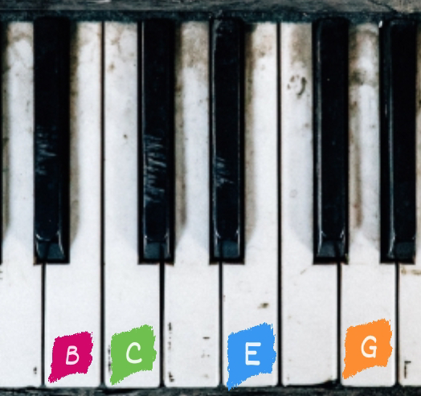

# SBR Tutorial

## Introduction

Welcome to the SBR tutorial! This guide will help you understand the basics of using the SBR project, including its features, commands, and how to get started with your own compositions

## Getting Started


### Install

```bash
git clone https://github.com/Brick-Briceno/SBR.git
cd SBR
pip install .
```

***The program must have a main.sm file to work, in which the data, commands or variables that you want to have loaded whenever you run the interpreter will be stored.***

## How to use

***To learn how to use it with "help:" in the console and all the information will appear***




*It's not necessary to have 2 parameters, it can be just one*

### Syntax

In case of havin purely numeric characters, it will be  
prossed as a mathematical operation and the order of the  
operations will be based on the PEMDAS standard (parentesis,  
exponents, multiplication, addition, subtraction)  

Examples:
```
5+5*2 = 15  
(5+5)*2 = 20

--You can do this as well  
(5+5)2 = 20  
```

but... and if it's melodic?  

However, in case of containing generators, effects or any musical data  
such as notes, tones, rhythms or a groups, everything will be  
processed left to right in this order  

Examples:  
```
  ↓↓↓↓all this are an argument, only one  
 B1000 L8 = B1000 1000  
 ↑     ↑     ↑  
 ↑     ↑     (zeros and ones) these are the rhythm data  
 ↑    (L) repeats the number of bits until x number long (effect)  
(B) is used to generate the bits (generator)  
```

The total of all the code is called Brick :D  
Other example  

```
 M0,-2,2,-1  
 ↑     ↑  
 ↑    (0,-2,2,-1) arguments are separated by commas  
(M) is used to generate the tones  
```

### Run some of these commands to take full advantage of the language's potential
```sbr
help: tutorial
help: effects --view all effects
help: generators --view all generators
help: commands --view all commands
help: operators
help: syntax
help: E

vars: --view actual variables

play: Sm{son*2; Jumps 5,-1,5,-1,5,-1,-2,-1,-1 Oct5}
play: Sm{E13S12X2; pop Oct6 Arp}*4
play: Sm{son S4 X2; pop Oct5}*4

```
```
-- this is a short comment :)

***
this is...
a long comment
I can write things
on the lines I want to
write, basically a multi-line comment
***

```
You can clear the SBR console with these commands:
```
clear
cls
...
..

```

```
-- these are rhythms
B1000*4
C3
E5,16

-- these are notes
1|5 -- 1st degree of the 5th octave
1b|7 -- 1st degree flat, 7th octave
1#|7 -- 1st degree flat, 7th octave

```
```
-- these are groups
-- you can save things in them

{} -- empty group

{1; 2; 3; 4; 5 -- you don't need a ";" here
6; 7; 8; 9}

-- this
{B10010010
{69}; 18
M0,1,2,3,4}
-- this is the same as this
{B1001 0010; {69}; 18; M1|, 2|, 3|, 4|, 5|}

```
```
-- these are tones
M33,34,35
M6|4, 7|4, 1|5

-- they are like groups but with notes
```

```
-- this is a melody

Sm{son*2; Jumps 4,1,-2,-1,-1,1,-1,-2,1 Oct5}

Sm{-- the melody must have rhythm and tones
B1001 0010 0010 1000*2
M1|5, 5|5, 4|5, 2|6, 1|6, 6|6, 5|6, 3|6, 2|6
}

play: Sm{son*2; Jumps 4,1,-2,-1,-1,1,-1,-2,1 Oct5}

```

### How to import Instruments and Sounds

You can import an instrument this way
**I recommend that you load all the instruments and sounds you are going to load in the initial main.sm file to avoid this repetitive task**

```
--Instruments
instrument: inst\Synt1
instrument: inst\Synt3

--Samples
instrument: inst\Vocal.wav

--Percusions
instrument: inst\Kick.wav
instrument: inst\Clap.wav
instrument: inst\Hat.wav
instrument: inst\Snare.wav
```

```
-- The instruments are called this way
$Synt1
$Kick

-- They will show something like this in the console
$12 ***$Synt1 recorded instrument from 'inst\Synt1'***
$15 ***$Kick sampled instrument from 'inst\Kick.wav'***

```

**The letter V indicates the velocity or force with which a note is hit, but in this case it means the decibels of the track. In melodies it ranges from 0 to 1, but in the case of structures it works from -∞ to 0**
```
-- creating a polyrhythm in SBR
tempo = 103
i_dance = Struct{
  V0; $Kick; bossa*2
  V0; $Clap; C8 >>4
  V0; $Hat; E13L32
}

play: i_dance * 2
```

```
-- creating a melody in SBR
mode = wind
tone = e_
tempo = 128

bass = Sm{
   B1010 1011*2 X8
   M1|1, 6|, 7|, 3|1, 2|1
}

play: bass*2 Oct3


```

### view the magic
```
-- creating a Song in SBR
mode = wind -- minor mode
tone = f_ -- f tone
tempo = 128 -- this is the tempo in bpm

-- melody

intervals = 0,4,0,-1,-1,

melody = Sm{
   (son Add14 * 3 C3,4*2X2Q4) * 2
   Jumps {
      intervals, -4, intervals, -1, intervals, 1, 1, 1, -4
      intervals, -4, intervals, -1, intervals, 1, 2, -4
      }
} Oct5

-- chords
chords = Sm{B1000X4*8;pop} Oct4

bass = Sm{
   B1010 1011*2 X8
   M1|1, 6|, 7|, 3|1, 2|1
} Oct3

song = Struct{
  --melody
   V0; $Harp; melody
   V0; $Harp; chords
   -- bass
   V3; $Jazz_Guitar; bass
   -- drumps
   V0; $Kick; C4,16 son
   V0; $Clap; C8 >>4 X2
   V0; $Hat; E13L32 X2
}

play: song

-- This song was made some time before starting SBR
-- https://youtu.be/FNt8UnD2Jl4

```

### You can pass arguments to the executable and open code files to test it

```bash
sm my_amazing_song.sm
py . my_amazing_song.sm
```

## SBR tools and commands

Arguments in commands are separeted by (::)

**help:** is used to search for documentation

**donate**: if you like this tool, help me keep growing <3

**exit**: exits the interpreter

**license**: displays the license

**print**: displays the data

**type**: displays the type(s) of data
*Example*
```
type: 1:: son:: pop:: $Seno
1 is an int
B1001 0010 0010 1000 is a Rhythm
M{1|;3|;5|},{-1|;1|;3|},{3|;5|;7|},{0|;2|;4|} is a Tones
$8 ***$Seno*** is an Instrument
```

**vars**: displays the variables in the system
**ident**: identifies the code
**play**: plays the data you enter
*Example*
```
-- plays the content
play: son

-- plays the content and pauses playback
--until the audio floats finish playing.
play: son:: true
```

**sm1**: a small piano roll I made in 2022-2023
**sleep**: pauses the code
**export**: exports the audio of the data in different formats

*Example*
```
export: song:: my_song.mp3
```

**metric**: measures the metric of rhythmic data

**editor**: a minimalist text editor

**rec**: records the rhythm you play on the console

**tap**: calculates the bpm you enter

**code_made**: displays and saves a history of the commands you have entered

**instrument**: is used to import an instrument, be it a folder or .wav file
