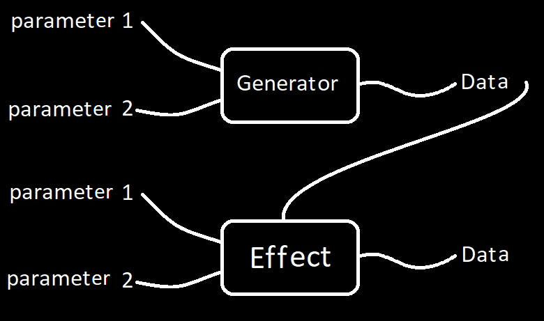

**Lenguaje SBR**  
Sintaxis Brick Ritmo

*Los siguientes son códigos para generar ritmos y melodías a través de algoritmos en el lenguaje SBR o el programa Symmetry Melody 2 ambos creados por [@Brick\_briceno](https://www.instagram.com/brick_briceno/?hl=es)*

*SBR es un lenguaje de programación con fines de entretenimiento enfocado a música y composición algorítmica, donde puedes hacer pop, rock, electrónica, diseño sonoro, drums de batería, ritmos africanos, facilidad para hacer melodías memorables bajo la filosofía simetric melody y un conjunto de herramientas para tener nuevas formas de ver la música donde puedes combinar tanto improvisación como una extrema planificación*

*Si lees este tutorial completo podrás experimentar, entretenerte y expresar todos tus pensamientos mediante la música, SBR no es un generador de melodías, quizás lo sea, pero solo es una manera que te facilita expresarte*

*Este mini tutorial estará dividido en 3 partes, primero la parte rítmica, seguido de la parte melódica o mejor dicho tonal, y finalmente la parte verdaderamente melódica, cómo unir un poco las piezas y algunas que otras herramientas del control de flujo, las palabras claves*

*Por cierto lo puedes descargar aquí:*  
[*Github.com/Brick-Briceno/SBR*](https://github.com/Brick-Briceno/SBR)

Para crear una melodía debemos definir como la sentimos, qué nos produce, y para eso entre otras como el tempo, tonalidad, modos, escalas, acordes, entre otros trozos con los que armaremos la canción

Pero lo principal, es una buena melodía, que nos cuente cosas, hay cosas importantes en una melodía, cuánto dura una nota… qué tan fuerte golpea… pero los 2 elementos principales más importantes en SBR son y siempre serán 

Tonos y… ritmo, que no solo se refiere a las baterías, si no también el ritmo de la melodía principal

SBR ofrece su propio estilo y forma de representar y escribir las melodías, su propio pentagrama

Pero para entender la filosofía Symmetric melody, “Sm” debemos entender 2 de sus grandes pilares

Tonos y… ritmo

Empecemos por la parte rítmica 

**El Ritmo** 🥁

*Nuestras literalmente piezas de Lego (ladrillos) serán…*

**Generadores:** C, B, E, A, N  
**Efectos:** L, X, D, R, I, \<\<, \>\>, \[, \], S, Q, \*  
**Operadores:** \+, \-, *nada*  
**Parámetros:** 1, 2, 3, 4, 5, 6, 7, 8, 9, 0

**C** (repetir un número)

*Cuando sale C seguido de un número significa que pondrá X pulsos cada determinada cantidad de tiempos hasta que el bucle termine, por defecto son 32 bits*

C3 \= 1001 0010 0100 1001 0010 0100 1001 0010  
C4 \= 1000 1000 1000 1000 1000 1000 1000 1000  
C5 \= 1000 0100 0010 0001 0000 1000 0100 0010

Si quieres que la longitud del bucle sea 8 lo escribes así

C3,8 \= 1001 0010

*Dato: 1 es un golpe, 0 es un silencio, cada dígito (por defecto) es una semicorchea, entonces por lógica “1000” es una negra, “1010” es un dosillo, “1111” un cuatrillo, “1000 0000” una redonda, pero… y qué pasa con el tresillo? ¿cómo puedo escribir una redonda de forma más corta? ¿cómo puedo hacer fusas? ¿Puedo en SBR crear mi propio sistema de escritura o hacer que los dígitos no sean semicorcheas sino otra cosa? ¿Qué otras formas hay de escribir el ritmo?*

la **C** es un **Generador**, los generadores pueden admitir varios parámetros, son como una especie de maquinita que le metes uno o más datos y te arroja un resultado, si nos ponemos más técnicos es en programación o matemáticas lo que llamamos una función

  
*Esto en SBR se Le conoce como bloque o Brick, se compone de:*

*Un generador (indispensable)*  
*Parámetros (opcional)*  
*Un efecto (opcional)*  
*Parámetros para el efecto (opcional)*

Puede haber un generador sin parámetros y con un valor preestablecido, puede también tener parámetros, puede tener efectos y estos pueden o no tener parámetros, al fin y al cabo en un bloque no puede haber 2 generadores, pero si en un código unimos varios bloques simplemente se pegan sin más complejidad

Pero… ¿Y cuales efectos hay?

**L** (definir la **L**ongitud)

la L es nuestro primer efecto

Si quieres que la longitud de un dato o ritmo sea 8 lo escribes así también

Se repite el bucle hasta finalizar las 8 semicorcheas o bits, pero recuerda que estamos en base a 16 por lo si no ponemos el valor L seguirá hasta llegar a 16

En realidad quedaría así

C3,16 \= 10010010 01001001

C3,16 \= C3L16

Si tenemos un ritmo más corto que el parámetro de L este repetirá el bucle hasta completar el parámetro L, osea lo cortará hasta donde esté diga

Por ejemplo

C3L4L8 \= 1001 1001

C3 nos arroja una secuencia de puros “100” repetidos hasta llegar a una longitud de 32, con L4 lo recortamos a 4 bits “1001” y después lo volvemos a alargar con otro efecto L pero alargando la a 8 bits, “osea mil uno mil uno”, “1001 1001”

*En este caso podría sonar como una marcha militar*

**B** (escribes el ritmo en binario)

En este maravilloso debes ponerle una B mayúscula al principio, B es un generador y los números son sus parámetros, o argumentos

B10101 \= 10101 ❌

B1L4    \= B1111     ✅  
B100L4  \= B1001     ✅  
B1000L8 \= B10001000 ✅

C3,4 \= B1001  
C3L4 \= B1001

Por cierto para reproducir el tipo de dato solo ponlo después de “play”, nuestra primera palabra clave, con esto puedes reproducir cualquier cosa

play B1000 1000 1001 1010

Te recomiendo que a lo largo de este tutorial vayas probando todo lo que te vayas consiguiendo para que veas como se vé y como suena cada cosa

**Variables 📦**

Sirven para guardar datos de todo tipo

mi\_variable \= B1001 0010 0010 1000

Te sirve para reciclar contenido, cosa útil en el pop o en las orquestas, también para representar figuras con sus nombres, lo que sea\!

negra \= B1000  
lampara \= B1000 1010  
navidad \= B1010 1000

play lampara lampara navidad navidad

“**play**” es una palabra clave para reproducir datos (de todo tipo), ritmos en este caso, pon ese codigo en el intérprete a ver que pasa

*Los nombre de variables no deben empezar por un número, tener espacios en medio, deben estar en minúsculas, (lowercase), medir más de un carácter, solo pueden tener caracteres del alfabeto inglés salvo la “ñ” que sí está permitida, tampoco deben ser el nombre de una palabra clave, como “**play**”, “**help**”, “**info**” entre otras*

*Por cierto escribe “**help**” en el intérprete a ver que te sale* 🥸

Con “**vars**” se pueden ver modos, ritmos, tonos, escalas y más recursos disponibles que puedes usar, que por cierto, los modos, como por ejemplo dórico, frigio, mixolidio y más, a pesar de ser cosas de tonos y no de ritmos, se definen con ritmos igualmente, así que lo que verás a continuación te servirá incluso para cambios modales, tempo o más a lo largo de la canción

Te mostraré un fragmento pequeño de lo que hay en el intérprete usando “**vars**”

offbeat \= B0010  
son \= B1001 0010 0010 1000 🇨🇺  
bossa \= B1001 0010 0010 0100 🇧🇷  
dembow \= B1001 0010 🇯🇲  
shiko \= B1000 1010 0010 1000  
soukous \= B1001 0010 0011 0000  
rumba \= B1001 0001 0010 1000  
gahu \= B1001 0010 0010 010  
true \= 1  
false \= 0  
phi \= 1.618033988749895  
pi \= 3.141592653589793  
euler \= 2.718281828459045

Y mucho más, progresiones de acordes y un montón de recursos por ahí

Más que variables son constantes, osea que no se pueden modificar o reemplazar por otra cosa

**N** (otra forma de escribir los ritmos) 

N3 3 2 \= B1001 0100  
N3 3 3 3 2 2 \= B1001 0010 0100 1010  
N2221 2221 2 \= B1010 1011 0101 0110 

*Son ritmos muy buenos los de arriba, yo los he usado en canciones, para percusiones y melodías*

**X** (duplicas la longitud del ritmo)  
*Estiras el ritmo*

Agarramos cada uno de los dígitos y entremedio le metemos (x cantidades de ceros menos 1\)

Ósea si tenemos por ejemplo  
B10010010X2

B10010010X2 \= B1000 0010 0000 1000

Reemplazamos los 1 por 10 y los 0 por 00  
Si X fuera 3 entonces 1 sería 100 y 0 seria 000 etc

B1X4L8 C3L8 \= B1000 1000 1001 0010

por cierto, los espacios en el código se eliminan automáticamente, los pongo para que visualmente se vea más claro

serán bloques separados, salvo que… usemos operadores, pero eso lo veremos más adelante

**E** (euclidiano)

Genera ritmos euclidianos, ritmos que suenan excelentes y se encuentran en la música tradicional de prácticamente todas las culturas por milenios

Aquí tienes un enlace de todas las culturas que usaron y siguen usando ritmos euclidianos

[The Euclidean Algorithm Generates Traditional Musical Rhythms](https://cgm.cs.mcgill.ca/~godfried/publications/banff.pdf)

Este artículo de 2004 me llevó a crear todo este lenguaje en 2022, sin él no lo hubiera hecho, el autor en paz descanse publicó un libro en su 2da edición por el año 2013, recomiendo leerlo habla de la relación de las matemáticas y el ritmo, por qué el son cubano es un ritmo tan bueno y cómo diferentes culturas hacen sus calendarios o entre otras cosas

En SBR puedes generar estos ritmos tan agradables y más

Pero ¿cómo funciona en realidad?

El 1er parámetro “x” define la cantidad de pulsos que se distribuirán de forma simétrica y uniforme en “y” (2do parámetro) cantidad de bits

E5,8 \= B1101 1010

5 pulsos en un total de 8 bits   
Osea, 5 pulsos y 3 ceros (8-5=3)

E3,8 \= B1001 0010

Por cierto si no asignamos un segundo parámetro, este se establecerá por defecto como 16 

E5,16 \= E5

Y si no asignamos nada este se establecerá como E5

E \= E5

De aquí podemos experimentar mucho con estos sonidos 

E4  \= B1000 1000 1000 1000  
E5  \= B1001 0010 0100 1000 \= E  
E6  \= B1001 0010 1001 0010  
E7  \= B1010 1001 0101 0010  
E8  \= B1010 1010 1010 1010  
E9  \= B1010 1011 0101 0110  
E10 \= B1011 0110 1011 0110

y así…

Por cierto, todos esos ritmos han sido hits musicales a lo largo de la historia, solo es cuestión de buscar cuáles son, y al final del artículo te pone ejemplos, no de música pop, pero sí música tradicional de culturas, por ejemplo la árabe, rusa, africana o incluso música tradicional rumana, en compás de 7/8

En caso de que añadamos un tercer parámetro este actuará como un efecto L, lo que puede darnos una gran variedad de ritmos

Varios de ellos los he escuchado en música pop, sobre todo en hits de los 80 y de alrededor de 2015

Ejemplo

E5,14,16  \= B1001 0010 0100 1010  
E10,15,16 \= B1101 1011 0110 1101

¿Has escuchado estos ritmos en alguna melodía de alguna canción? A mí se me vienen a la mente 3, ejemplos, Ariana grande, Shakira, y AC DC

Mientras más famosa la canción más presentes están

Los ritmos euclidianos esconden una ciencia detrás, puedes leer más sobre esto en un artículo de esta documentación llamado *“La magia de los ritmos euclidianos”* donde conocerás curiosidades sobre estos y su increíble historia

Léelo porque esa información no te la cuentan en casi ningúna parte de internet, ni siquiera en los conservatorios, y todo eso no lo puedo resumir en un tutorial tan corto

**\+** (superpone 2 ritmos)  
Este es nuestro primer operador, es una compuerta “OR”, puedes leer sobre esto en internet, se usa en electrónica digital, relacionado a la electricidad

Ejemplo

B1X4L8 \+ C3L8 \= B10011010

B1100 \+ B1010 \= B1110

**\-** (elimina pulsos donde sean iguales)  
*Es una compuerta ‘XOR”*

*0 xor 0 \= 0*  
*1 xor 0 \= 1*  
*0 xor 1 \= 1*  
*1 xor 1 \= 0*

B0101 \- B0011 \= B0110

E3,8 \- E4,8 \= 00010010

**R** (revierte el ritmo)

E1,10,16  \= 1000000000100000  
E1,10,16R \= 0000010000000001

**I** (invierte el ritmo)  
*A esto se le llama compuerta not*

E5,14,16  \= 1001001001001010

E5,14,16I \= 0110110110110101

**\<\<** (cambia una posición a la izquierda)  
*En lenguaje C es un operador que hace exactamente lo mismo que aquí, solo que aquí es un efecto*

B0101\<\< \= B1010

**\>\>** (cambia una posición a la derecha)

B0101\>\> \= B1010

*No es necesario que le pongas ningún parámetro si quieres que sea 1*

E5\>\>  \= B0100 1001 0010 0100  
E5\>\>2 \= B0010 0100 1001 0010  
E5\>\>3 \= B0001 0010 0100 1001

Curiosamente…  
E5\>\>,I \= E3

**()** paréntesis

(C3L8\<\< \+ B0111L8)I \= B1000 1000 

Imaginemos que queremos invertir, revertir o aplicar cualquier otro efecto a un conjunto grande de otros ritmos, pues para eso nos sirven los paréntesis

**\*** (Multiplica y repite datos)

B1000 1000 \* 2 \= B1000 1000 1000 1000   
N5L8 \* 8 \+ C4 \= B1000 1100 1000 1100 1000 1100 1000 1100 1000 0100 1000 0100 1000 0100 1000 0100

**S** (dejo pasar solo ciertos pulsos)
*En el ejemplo el 2 y el 4*

B1000 1000 1000 1000 S2,4 = B0000 1000 0000 1000

*Sirve para hace contratiempos o para crear contenido rítmico de motivos melódicos a partir de otros ritmos, una técnica muy usada en la música*

**SS** (dejo pasar solo cierta cantidad de pulsos)  
*Imagínate que tienes una melodía con un ritmo para una letra que tiene siete sílabas contadas, solo quieres dejar pasar las primeras 9 notas*

Tomamos un ritmo con 9 pulsos 

E9 \= B1010 1011 0101 0110

Y dejemos pasar solo los primeros 7   
E9SS \= B1010 1011 0101 0000

7 es el valor por defecto… de este efecto

Si quieres vamos a dejar pasar solo los primeros tres cursos pies…

E,SS3 \= B1001 0010 0000 0000

*Si te preguntas qué hace esa coma ahí, pues debes separar los efectos o generadores con algún argumento o una coma para saber que no quieres usar un efecto que no existe, “ES” por ejemplo*

*Pero… ¿Qué pasa si no quiero quitar los primeros pulsos sino que quiero tenerlo de forma más simétrica y escoger cuáles pulsos quiero quitar?*

*Pues para eso nos sirve nuestro siguiente efecto*

**Q** (quito pulsos)  
*En muchas canciones es muy común tener un ritmo de la melodía o del ritmo y quitar notas y ponerlas después para sorprender por presencia o por su ausencia*

E,Q  \= E,Q1  
E    \= B1001 0010 0100 1000  
E,Q1 \= B0001 0010 0100 1000   
E,Q2 \= B1000 0010 0100 1000   
E,Q3 \= B1001 0000 0100 1000

Y si quiero agregar pulsos?

**Add** (agrega pulsos al bit que tú quieras)

B1001 0010 Add 4 \= B1001 1010

**\[** y **\]** (Contar el ritmo por pedazos)

Supongamos que queremos repetir una melodía o un ritmo para crear un poco de familiaridad  
B10011010\[4 \= B1010  
B10011010\]4 \= B1001

*mostrará desde el primer bit hasta el cuarto, si queremos repetir esto…*

B10011010\]4L2 \= B10011001

**3** (no es un efecto ni un generador, es un dato)

un dato como el **“1”** y el **“0”**, el **“3”** significa tresillo de negra, por lo tanto mide 4 bits

¿Qué pasa si sumamos el 3 a un patrón? se suma igual

B3     1010 \= B3    1010

esto tiene una duración de una negras ya que el 3 ocupa 4 espacios en la dimensión temporal

¿Qué pasa si superponemos el 3 a un patrón? buscará la forma más simétrica de hacerlo

pasa algo muy interesante

B3+B1010 \= B1110

***6** (representa el tresillo de blanca)*

B3X2 \= B6

¿Pero qué pasa al superponerlo con otro ritmo?

Distribuirá de forma **simétrica** en la duración de ese pulso y después lo superpondrá con este

B6 \- B0000 \= B1001 0010  
B6 \- B0000 \= E3,8

Es como que el 3 viene por defecto en el primer parámetro del comando **E** y el segundo parametro seria la X

B3X2 \= E3,8  
B3X4 \= E3,16  
B3X8 \= E3,32

**A** aleatorio (genera un número aleatorio con la longitud de su parámetro)

*Útil al no tener inspiración, lo aleatorio suele ser asimétrico por lo que puede sonar feo, pero con técnicas como una moderada repetición creativamente se puede obtener un buen resultado, en otras palabras mezclarlo con el efecto “\[\]” puede ser una gran ayuda*

A4 ≈ 1000  
A4 ≈ 0100  
A4 ≈ 1001  
A4 ≈ 0011

puede ser cualquier cosa, pero también este efecto también puede tener un 2do parámetro

Si ponemos “0” al 2do parámetro este tendrá un número aleatorio pero siempre el primer dato será 1

A4,0 ≈ 1000  
A4,0 ≈ 1100  
A4,0 ≈ 1001  
A4,0 ≈ 1011

Si ponemos un número mayor a cero, 7 por ejemplo podemos crear una célula rítmica de 7 pulsos que pueden ser cualquier ritmo

A16,7 ≈ B1100 0010 1001 1100

**Los Tonos 🎹**

**Generadores**: M, J  
**Efectos**: L, X, D, R, I, \<\<, \>\>, \[, \], S, Q, \*, G, Oct  
**Operadores**: \+, \-, nada  
**Parámetros**: números y Notes

*Aquí nos basamos en la dimensión vertical en qué tan grave o agudo suena una nota*

*Si quieres conocer sobre teoría musical básica te recomiendo una sección llamada “teoría musical básica” en esta documentación*

¿Cómo representamos la información Tonal? 🤔

*Pues déjame decirte que SBR es diatónico, O sea que solamente vamos a jugar con las notas de esa escala, si bien podemos poner notas cromáticas, por temas de practicidad SBR tiene una filosofía y un entorno diatónico*

**Grupos**  
{1; 2; 3; 4; 5; 6; 7; 8; 9}

Los grupos o listas por lo general son cajas donde guardas todo tipo de datos al igual que las variables, se separan con punto y coma tal como se vé arriba

Una forma de acceder a su contenido interno (items) es con el efecto “Grp”, para acceder al 1er ítem se empieza desde el 0

{1; 2; 3} Grp 0 \= 1  
{1; 2; 3} Grp 1 \= 2  
{1; 2; 3} Grp 1 \= 3

Una forma de generar secuencias de números es con “Range”, se empieza desde el cero por motivos prácticos de los que no vamos a hablar aún

Si le pones un solo argumento irá desde el 0 al 10  
Range 10 \= {0; 1; 2; 3; 4; 5; 6; 7; 8; 9}

Si le pones 2 argumentos irá de un extremo al otro

Range 10, 20 \= {10; 11; 12; 13; 14; 15; 16; 17; 18; 19}

Pero si le pones un 3er argumento se saltará esa cantidad

Range 10, 20, 2 \= {10; 12; 14; 16; 18}

Velo como 1\. desde, 2\. hasta y 3\. ve de x en x (de 2 en 2 en este caso)

Multiplicar  
{1; 2; 3} \* 2 \= {1; 2; 3; 1; 2; 3}

Hay casos donde puedes llegar a usar las comas que si bien están reservadas para los argumentos de generadores y efectos también es casos muy especiales pueden generar grupos

1, 2, 3   \= {1; 2; 3}  
{1, 2, 3} \= {{1; 2; 3}}

En este último caso genera un grupo dentro de un grupo, esto es algo muy importante que debes tomar en cuenta al hacer melodías y cosas en SBR

En si quieres aislarlo de otros elementos puedes hacer lo siguiente

(1, 2, 3\) \= {1; 2; 3}

**Notes** (notas)  
*Grado | Octava*

1|5 \= (primer grado de la 5ta octava)

Si le sumas un grado sería un 2do grado de la 5ta octava  
1|5+1 \= 2|5

Pero si encierras una parte del código en paréntesis de esta manera 5 \+ 1 es 6 entonces sería 1er grado de la 6ta octava

1|(5+1) \= 1|6

Y como “no existe un 8vo grado” entre comillas, que a lo mucho sería… su mismo nombre lo dice, ¡una 8va\! se movería un número a la derecha, por lo tanto sería esto

8|5 \= 1|6

Y si SBR es diatónico esto significa que no tenemos sostenidos y bemoles? Pues sí los tenemos

Solo debemos escribir un “b” minúscula o un corchete “\#” al antes, después o entre el dato de la nota

\#1|5 o b1|5

Esto restará un tono cromático a la nota, independientemente de la escala en la que estés

Por ejemplo si estás en Do major o jónico o modo lidio, un 7|4 sonará igual a b1|5

*Por cierto, también podrías utilizar los enteros como notas, aunque no es una práctica recomendable, ya que es visualmente más complicado de ver aunque quizás te termines acostumbrando*

*La idea sería tomar la octava, multiplicarlo por 7 y sumarle el grado menos 1 algo así “octava\*7+grado-1” de modo que 1|5 sería 34*

*De hecho si pones b34 te sale b1|5 porque el intérprete lo visualiza de esa manera, aunque repito, no es una práctica recomendada*

Y como defino la escala? Pues… la escala es la mezcla de el modo y el tono, solo debes hacer esto

tone \= e\_

Esto hace que la tonalidad de la canción sea “Mi”, si quieres que sea “Sol” solo pon “g\_”, para “Si” pon “b\_” y así, para Fa sostenido pon “f\#\_”

Estas son variables (o más bien constantes porque no se pueden modificar) que almacenan enteros, el Do sería 0 y el Si 11

Para el modo debemos meter un dato rítmico, tal así

mode \= B101011010101

*Los unos sólo en este caso serían las teclas blancas de un piano y las negras los serios, si conoces del mundo se la armonía modal sabrás que con el efecto “\<\<” para los ritmos puede servir en este caso para cambiar de modo siempre y cuando el ritmo toque en un 1*

Obviamente para esto hay variables

mode \= wind  
– viento o modo menor  
mode \= lonic  
– lonic, jonico o mejor dicho modo mayor

Con el comando “vars” se pueden ver otros modos, ritmos, tonos, escalas y más recursos disponibles que puedes usar

*Por cierto, a finales de 2023 descubrí experimentando con python en mi teléfono, que los ritmos euclidianos pueden generar las escalas de la música modal de los últimos cientos de años, me explotó la cabeza cuando lo ví*

**M** (es como el B de los tonos)

“M” es un generador que retorna un objeto iterable ¿Y esto qué quiere decir? que es como un grupo

Permite meter tanto enteros como notas

M35, 36, 37 \= M1|5, 2|5, 3|5

También podemos usar el efecto “Oct” que simplemente sube o disminuye octavas

M1|, 2|, 3| Oct5 \= M1|5, 2|5, 3|5

M0, 1, 2 Oct5 \= M1|5, 2|5, 3|5

“J” sirve para generar tonos a partir de intervalos de un grupo o lista pasado como argumento, esto de los grupos lo veremos más adelante

intervals \= 0, 4, 0, \-1, \-1

J0,{  
   intervals, \-4, intervals, \-1, intervals, 1, 1, 1, \-4  
   intervals, \-4, intervals, \-1, intervals, 1, 2,    \-4  
   }

Por motivos prácticos el generador “J” aplica algo llamado recursión, toma los números de los grupos dentro de otros grupos hasta el infinito hasta tener una lista con solo número que después retorna tonos

Ese de arriba es el contenido tonal de una canción que saqué hace tiempo, en 2022  
[Just do it \- Brick Briceño 🧡💙](https://www.youtube.com/watch?v=FNt8UnD2Jl4)

Una forma que quizás te sea muy fácil y muy práctica de escribir tonos, usando la “G”, sin necesidad de poner comas y esas cosas ya puedes escribir los grados de tu melodía, en este caso el contenido tonal de cumpleaños feliz

G1121 43 1121 54 Oct5 \= M1|5, 1|5, 2|5, 1|5, 4|5, 3|5, 1|5, 1|5, 2|5, 1|5, 5|5, 4|5

Y comó puedo **hacer acordes**? simple, metele grupos con las notas dentro, de este modo se reproducen las notas de un grupo al mismo tiempo

M{1| ;3| ;5|}, {6|; 1| ;3|}, {3|; 5|; 7|}, {7|; 2|; 4|} Oct4

Si quieres crear acordes a partir del efecto “Chord”, que crea armonías

M0, \-2, 2, \-1 Oct5, Chord 1, 3, 5 \= M{1|5;3|5;5|5},{6|4;1|5;3|5},{3|5;5|5;7|5},{6|4;1|5;3|5}

Puedes crear quintas con “Chord 1, 5” o séptimas con “Chord 1, 3, 5, 7”

Si quieres extraer las notas y dejarlas sin grupos, como por ejemplo si quieres convertir los acordes en un arpegio puedes usar “Arp”

M0, \-2, 2, \-1 Oct5, Chord 1, 3, 5, Arp \= M1|5, 3|5, 5|5, 6|4, 1|5, 3|5, 3|5, 5|5, 7|5, 7|4, 2|5, 4|5

**Melodías** (Y un poco de mezcla)  
Sm{bossa; G 88857} Oct5 \* 2

Simplemente mete el contenido tonal y rítmico en un una lista o grupo y pasalo como argumento al generador “Sm”, siglas de Symmetrical melody

intervals \= 0,4,0,-1,-1

melody \= Sm{  
   (son Add14 \* 3 C3,4\*2 X2 Q4) \* 2  
   J0,{  
      intervals, \-4, intervals, \-1, intervals, 1, 1, 1, \-4  
      intervals, \-4, intervals, \-1, intervals, 1, 2,    \-4  
      }  
} Oct5

\-- chords  
chords \= Sm{B1000X4 \* 8; pop} Oct4

bass \= Sm{  
   B1010 1011\*2 X8  
   M1|1, 6|, 7|, 3|1, 2|1  
} Oct3

Si no sabes qué son los guiones dobles son para **comentar** el codigo, osea, notas para saber qué porongas fué lo que hiciste ahí y darte una idea de como vá el código

E5,14,16 – hola esto es un comentario

– soy ignorado por el compilador e intérprete para ayudar al compositor a guiarse

Hablaré más cosas importantes sobre los comentarios más adelante

**Números**  
2+2 \= 4

Ya que posiblemente los números los aprendiste en la escuela pasaré a la parte sobre los operadores, que por cierto, sabemos que hay tipos de datos flotantes (decimales), y enteros

2 \+ 2 \= 4  
8 \- 3 \= 5  
5 \* 5 \= 25  
(5)5 \= 25  
5 / 2 \= 2.5  
5 // 2 \= 2   – división entera, sin decimales

\~ 5 \= 5I \= \-6 – sirve para invertir un numero al igual que la “I” (i mayúscula)

1 ^ 1 \= 0   – “compuerta Xor” (busca sobre eso)  
1 & 0 \= 1  – “compuerta and” (busca sobre eso)

3 % 2 \= 1 – resto de una división, sirve para muchas cosas, entre ellas saber si un número es par, esto tiene interesantes aplicaciones con los ritmos euclidianos

2.85 Round \= 3 – “Round” es un efecto numérico que sirve para redondear números

Random –  te dará enteros aleatorios salvo le metas flotantes, por defecto te arroja floats de \-1 a 1 pero puedes definir de dónde a dónde puede ir ese rango, también puedes seleccionar elementos de una lista

Random ≈ 0.4284344219472829  
Random ≈ \-0.09917189446713803  
Random ≈ 0.7384207824723916  
Random 50, 100 ≈ 56  
Random 50, 100 ≈ 97  
Random 50, 100 ≈ 70  
Random 50, 100 ≈ 53

Random {1; 3; 5} ≈ 5  
Random {1; 3; 5} ≈ 1  
Random {1; 3; 5} ≈ 3

Random{"apple"; "mango"; son; lonic; 5\*5} ≈ 25  
Random{"apple"; "mango"; son; lonic; 5\*5} ≈ B1010 1101 0101  
Random{"apple"; "mango"; son; lonic; 5\*5} ≈ B1001 0010 0010 1000  
Random{"apple"; "mango"; son; lonic; 5\*5} ≈ B1010 1101 0101  
Random{"apple"; "mango"; son; lonic; 5\*5} ≈ "mango"  
Random{"apple"; "mango"; son; lonic; 5\*5} ≈ B1010 1101 0101  
Random{"apple"; "mango"; son; lonic; 5\*5} ≈ "mango"  
Random{"apple"; "mango"; son; lonic; 5\*5} ≈ "apple"

**Strings**  
"your age is 24 years"

No tiene mucha ciencia solo abre y cierras con comillas dobles, del resto puedes poder letras de canciones codigo para sintetizar audio u otras cosas más avanzadas que puedes hacer  
Como curiosidad existe el F String o String formateado donde puedes meter bloques de código o variables dentro, donde simplemente pones el string con el código entre llaves como argumento del generador “F”

age \= 24  
F"your age is {age} years"

Por cierto en este lenguaje puedes poner saltos de linea con solo las comillas dobles sin más

"  
Hola esto es una línea  
y esta es otra línea  
"

También puedes multiplicar y repetir

"hola " \* 5 \= "hola hola hola hola hola " – el hola aquí lleva un espacio al final

Me parece relevante mencionar la herramienta “info” que sirve para varios tipos de datos entre ellos texto, en el caso de los strings te muestra cierta información relevante, si pones

info "hola como estás? espero muy bien"

Te muestra lo siguiente

Text Features:  
Words 6  
Reading Time 1.44 s  
Characters 32  
Characters without spaces 27  
Paragraphs 1  
Sentences 2

Tiempo de lectura, párrafos, palabras, entre otros

**Booleanos**  
true

Encendido o apagado, si o no, bueno o malo, así de básico es, no son tipos de datos, solo no variables inmutables o constantes (no se pueden modificar) que guardan un 1 o un 0

true \= 1  
false \= 0

A continuación te enseñaré a ver todas estas variables, mutables e inmutables

Usa “vars”, una herramienta muy simple que te muestra las variables

**Palabras claves**  
play song : true

Sirven para realizar tareas, son literalmente programas dentro de programas que sirven para una infinidad de cosas como reproducir tu canción, exportar el audio para enviarselo a alguien, samplearlo, o exportar el midi para llevar la melodía a una estación de audio digital profesional (DAW), visualizar la melodía, ejecutar el código varias veces, o si cumplen condiciones, pausar el código por un tiempo, grabar un ritmo con el teclado, marcar el tempo que quieres en la canción o cosas tan útiles como tocar el piano

Cada una de estas palabras claves es un mundo, pero para usarlos solo debes poner su nombre y sus argumentos si los requiere separados con doble punto :

En el caso de “play” como primer argumento le pones algun dato rítmico, después un booleano

play M|5 : true

Esto pausa el código hasta que se termine de reproducir la última muestra de audio, osea que si el sonido tiene una rever larga va a tardar en continuar el codigo, caso contrario si pones false o un cero, o simplemente nada

play B1000 \* 4

Una buena forma de buscar ayuda es usando “help” te muestra mucha información sobre el lenguaje, te explicaria pero ese mismo comando o palabra clave habla sobre sí misma y mucho más

Otra muy buena es “vars” te muestra todas las variables registradas en ese momento

“export” también te puede servir guardas el dato en formato wav, mp3, ogg, mid entre otros, con este ultimo puedes usar las melodías en otro software de audio profesional para hacer mezcla

**Consejos y estándares para escribir código limpio**

Mira, muchos proyectos o canciones pueden tener su propio estilo de codificación (formas de ordenar el código), y lo que diré aquí no es una verdad absoluta, debido a que es un lenguaje nuevo y de momento el único que lo conoce soy yo y algunos conocen un poco, cada quien puede descubrir nuevas formas de codificar pero me inspiro en varios lenguajes y estándares como el pep 8 de Python [peps.python.org/pep-0008](http://peps.python.org/pep-0008) (en ingles) me parece una buena forma de inspiración

Por cierto, la prioridad es que funcione, que la canción sea buena, si no es así mejor que esté desordenando

**Buenos nombres de variables**  
Que sean descriptivos

a ❌  
melody ⚠️  
drop\_vocal\_rh\_part\_a ✅

“drop” indica que es el coro, “vocal” significa que es la melodía de la voz, si es electronica o musica instrumental lo puedes llamar “lead”, “rh” puede ser una contracción de rhythm osea ritmo en ingles, osea el contenido rítmico de la melodía, y como la melodía tiene varias partes “part\_a” significa que es la parte A y que hay otras partes, B, C o quizas D, etc

Pero… ¿Es necesario ser tan descriptivo? Si estás empezando la canción y quieres algo simple, quizás una letra o un par de ellas te sirvan por practicidad para los nombres de variables, pero, si la canción va tomando forma y va creciendo, es casi imposible no organizarse

**Ritmos**  
Es bueno cuando los ritmos los separas por pulsos para poder leerlos de mejor forma, en este caso cada 4 semicorcheas

B1001001001001000    ❌  
B1001 0010 0100 1000 ✅

Tonos

Creo que al ver y sentir el ritmo puedes cantar los tonos, pero si lo requieres puedes poner espacios para acomodar las notas al ritmo

Grupos

En el caso de los acordes es más legible cuando usas el efecto “Chord” en vez de los acordes compilados

estrofa\_chords\_tones \= M{1|5;3|5;5|5},{6|4;1|5;3|5},{3|5;5|5;7|5},{7|4;2|5;4|5} ⚠️

Al ver el primer número de cada grupo “marcado en rojo” puedes ver el grado que el acorde está tocando, pero sigue habiendo información irrelevante

estrofa\_chords\_tones \= 0 ,-2, 2, \-1 Chord 1,3,5 Oct5

**Comentarios**

En ocasiones el código es bastante claro y es innecesario y hasta molestoso un código sobre comentado con cosas super obvias como “-- esto es un ritmo que hace tun pa pa tun pa”, no hace falta, añade comentarios a cosas que se te pueden olvidar o le ahorraría a la persona o a ti 10 segundos en entender algo que no se capta a simple vista

A veces los comentarios son necesarios, por ejemplo, al igual que en este tutorial remarco y separo los temas por títulos, lo mismo hago en un código de sbr

Y no solo me refiero a que hagas todo el contenido rítmico de todas las melodias y armonias de la canción en una zona, y que los tonos y los intervalos de estas en otra zona muy a parte, si no que también me refiero a partes dentro de partes muy pequeñitas en la canción

                            "  ...  Rhythmic  ...  "

\--                part A               part B  
drop\_vocal\_rh\_a \= B1010 0010 1000 1010 0000 0000 1010 1010  \-- metric 10  
drop\_vocal\_rh\_b \= B1000\*2  B 1010\*2  B 1000\*2    B1X8       \-- metric 9  
\--                  part A              part B  
drop\_vocal\_rh\_c \= B{1000 0000 0000 1010 0000 0000 1000 1000 \-- part C-A  
                    0000 1000 0000 0000 0000 0000 0000 0000 \-- part C-B  
                  }  
                  \-- curioso que los sonidos no se superponen  
                  \-- parte c dura el doble

                     \-- A B A B C C  
rh\_content \= B{drop\_vocal\_rh\_a drop\_vocal\_rh\_b  
               drop\_vocal\_rh\_a drop\_vocal\_rh\_b  
               drop\_vocal\_rh\_c drop\_vocal\_rh\_c  
            }

Como puedes observar, los string que no se guardan en ninguna variable o pasan por alguna característica del lenguaje y solo se ejecuta al aire sin más, podemos perfectamente tomarla como un comentario, más que todo como decoración y separador de responsabilidades, osea, de este lado me encargo de esto y de este lado lo otro

Los comentarios tienen un montón de espacios para y justo en el sitio de sus partes y te indican la métrica de estas

En la variable “drop\_vocal\_rh\_b” podemos ver como se usan espacios para sincronizar las distintas partes una encima de la otra así como se usan signos de multiplicación para repetir mismas partes varias veces

Dependiendo de tu técnica de composición quizás no sea necesario ser tán específico siempre quizás poner cosas como “manzana” o “i\_luv\_u” para repetir esas partes de la forma más irregular posible te pueda dar mejores resultados

Algo que te recomiendo hacer es alternar un poco de ambos mundos como todo en la música hay que ser abierto de mente

**No uses más de 70 caracteres** por línea, esto hace que las personas con pantalla pequeña lo puedan ver mejor, además que tampoco queremos tener una línea infinita que rompa por completo el scroll horizontal

**Palabras claves** (Herramientas)  
No las voy a colocar todas porque son muchas pero voy a poner las más importantes

if .......... If you try, you can't fail, failure comes from not trying  
for ......... They did it for you, you do it for them  
while ....... While there is music, there is life, and while there is life, there is music  
fn .......... Hello, have a nice day\! :D  
raise ....... There's no description  
define ...... Define like in C  
reset ....... Reset all  
quit ........ I exit the program  
exit ........ I exit the program  
help ........ Everyone asks me for help but, no one asks me how I am  
vars ........ I show you all the variables and others things  
donate ...... Help this project continue to grow  
welcome ..... I import external resources into the project  
licence ..... Show license  
print ....... I show things on the console, and... that's it  
share ....... Share your song as QR or base 64 code  
receive ..... I receive your song as base64 code  
info ........ I do several things depending on the type of data you give me  
type ........ I display the data type of what you give me  
pulse ....... Change the time signature  
clock ....... There's no description  
ident ....... I ident ur code babe :-3  
play ........ I bring the sense of sound to life in your brain  
pause ....... Umm i just pause, i don't know what u wanna i say .-.  
sm .......... A little script console melody preview that i made in 2024 after work :)  
sleep ....... I pause the code for a few seconds  
export ...... I export addictive substances... the music\!\!\! I've it in mp3, wav and mid, which do you want?  
drag\_n\_drop . There's no description  
metric ...... How many pulses does any data have  
len ......... What length is a data  
phrase ...... There's no description  
piano ....... I'm a piano on a console, what can I say?  
rec ......... Hit a enter key on the console and I'll record your rhythm B)  
tap ......... Use me for know the tempo that you are beating  
ls .......... If you wanna i show you files and folders...  
games ....... I'm a menu with several musical games 4 you ;D  
code\_made ... I remember all you really do it  
instrument .. I record an instrument  
set\_max\_digits  Don't looking for the 5th hand's cat, I'm not so interesting  
brute\_force . I use brute force to discover data combinations, compressing and summarizing musical information  
del\_temp .... I clear temporary files  
valve\_gain .. Set the gain for the valve distortion effect in master

Puedes encontrar más sobre esto en el intérprete, que por cierto de momento estará todo en ingles, prueba y experimenta con ellos

Otras herramientas podrían ser el generador “SBR” que ejecuta un string como si fuera código, o el efecto “Metric” o “Len” herramientas simples pero con mucho potencial, que te devuelven esas caracteristicas de datos musicales para automatizar otras cosas

**Diseño de sonido** (timbres)

El diseño de sonido es muy utilizado en música electrónica, lo que no se dice es que también puede ser usado en cualquier otro estilo de música como el rock por ejemplo 

También se usa en el cine para hacer foleys o sonidos de ambient, también puedes hacer percusiones donde nunca te imaginarias que son sonidos grabados y no sintéticos, puedes incluso emular el sonido de una guitarra eléctrica con todas sus características humanas

También se suele usar obviamente en la electrónica como por ejemplo en el dubstep con sonidos explosivos y muy complejos de hacer, como por ejemplo en la obra “First of the Year (Equinox)” de Skrillex donde los sonidos algunos fuera de escalar parecen el solo de una guitarra eléctrica justo antes de que un meteorito golpee la tierra o mientras

O los sonidos de la actual música “ambient” con sonidos suaves y atmosféricos que nos producen la nostalgia de momentos o alguna persona que fué importante en el pasado mientras hay colores fríos o ambientes nostálgico estilo arte “dream core”

Próximamente terminaré este tutorial  

